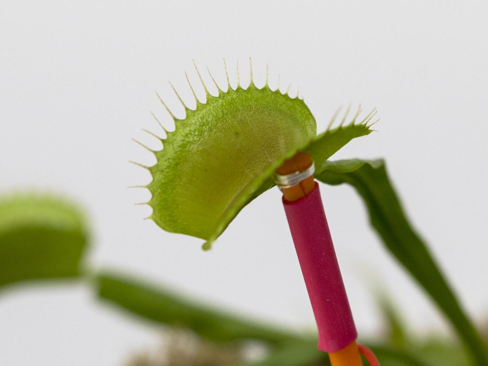
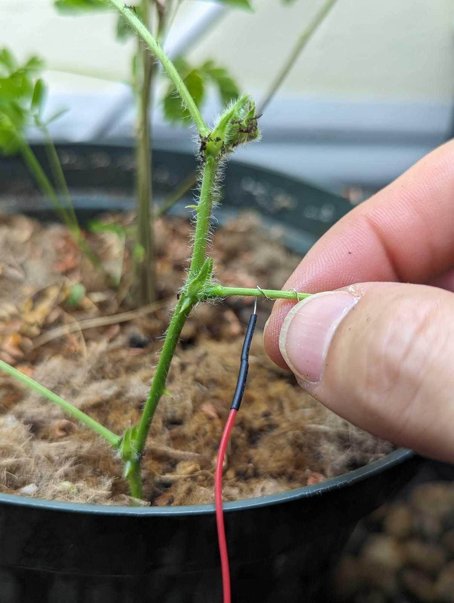
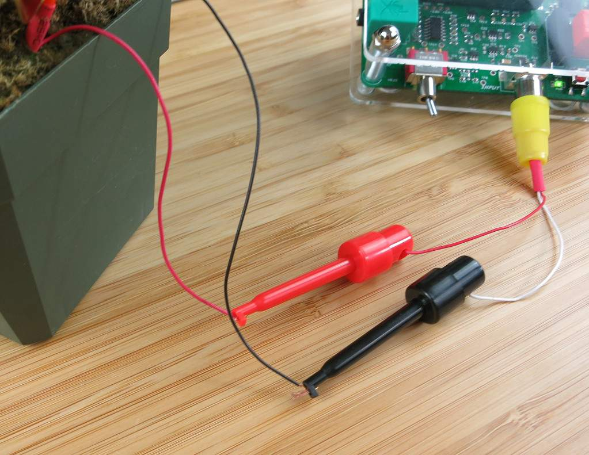

# Plant SpikerBox #

The Plant SpikerBox allows for data-driven experiments between various species of plants.

## Getting Started ##

Below are some basic setup steps for recording plant action potentials, for more advanced aplications, check out [our experiment pages](#experiments)

First, decide which experiment you are doing and the materials you will need.

For the Venus Flytrap experiment, you need the yellow RCA cable, one of the orange and red stake electrodes, and a black ground pin electrode. Place the stake electrode in the soil  close to the trap you’re going to record from, situating the silver wire around the tip close to the outside of the trap. Plant the black ground pin electrode into the soil.

For the Sensitive Mimosa experiment, you need the yellow RCA cable, the long red electrode wire, and a black ground pin electrode. Carefully, wrap the silver tip from the long red electrode wire snugly around a large Mimosa branch, close to the joint where the branch meets the stem. Plant the black ground pin electrode into the soil.

Place a dab of electrode gel at the contact points between your electrodes and the plants. This will increase conductivity for your experiment readings. Also make sure the soil is damp.

Plug in the yellow RCA with black and red electrode clips. Push down the tops of these clips to expose the metal hooks, and clip the red hook to the recording wire and the black hook to the ground wire.  

Power on the Plant SpikerBox with a 9V battery, and turn on the red switch at the front of the SpikerBox.

If you are using a smartphone or tablet, plug the green smartphone cable into the green output jack to connect the Plant SpikerBox. 

If recording on a computer, plug the blue USB cable into the metal port on the back of the board to connect.

Open SpikeRecorder on your device. [click here for more details about connecting](../../software/SpikeRecorder/)

You are ready to start experimenting!
What will you discover?

## Technical Specifications ##

|||
|---|---|
|Frequency range |0.07Hz-8.8Hz|
|Gain|72x|
|Output|Green Smartphone Cable, Blue Laptop Cable, microUSB, plant stimulation cable|
|Inputs|1x Plant electrode cable consisting of two silver wires|

[Technical Schematic](https://backyardbrains.com/products/files/PSBV0.24.pdf)

## Experiments ##

[Discover how Venus Flytraps detect and trap their prey!](https://backyardbrains.com/experiments/Plants_VenusFlytrap)

[Learn about the Sensitive Mimosa Pudica and it's beautiful, folding leaves.](https://backyardbrains.com/experiments/Plants_SensitiveMimosaPudica)

[Interspecies Plant-Plant-Communication: See how one plant controls the behavior of the other.](https://backyardbrains.com/experiments/Plants_plantplantcommunicator)

## Using Other Plants ##

In our experiments we focus on “behaviour plants” like the Mimosa Pudica and Venus Flytrap because they provide a reliable signal for us to measure, and they’re visually interesting as well.

You can record signals from other plants as well, however, they will probably be somewhat less reliable.
For example, we have studied about 14 different types of agricultural plants, and found about 50% have a wound response when you burn a leaf.

The most reliable “non-rapid movement” plants are the sundew (drosera), tomato, and basil plants. You wrap a wire around a branch (apply gel), put the ground in ground, and apply a flame stimulus to a leaf. A few seconds later you should see an “alarm” wound potential.

## Troubleshooting ##

Check out the [General Troubleshooting steps](../../index.md#troubleshooting)

When doing the Plant-Plant communication experiment:
If an action potential fires, but it doesn't drop the branch, try swapping out for a fresh battery, moving the ground pin closer to the stem of the Mimosa, or adjusting the silver wire electrode's positioning or the amount of conductive gel on the branch.

You can also test the stimulation without a "master" plant by touching the middle pin on the inut connector (picture below) with a screwdriver or your finger.

You should see the red LED on the board light up for a while to indicate stimulation.
If you are connected to SpikeRecorder, you should also see the graph change dramaticaly when you do this.