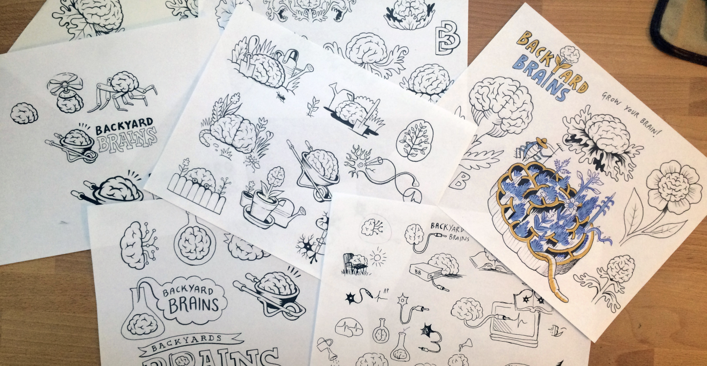
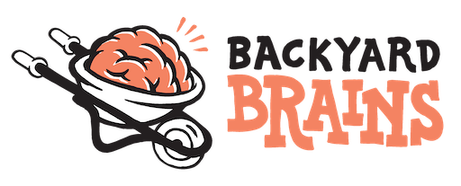
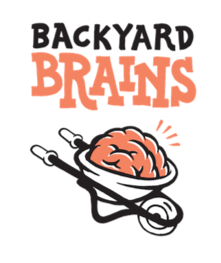
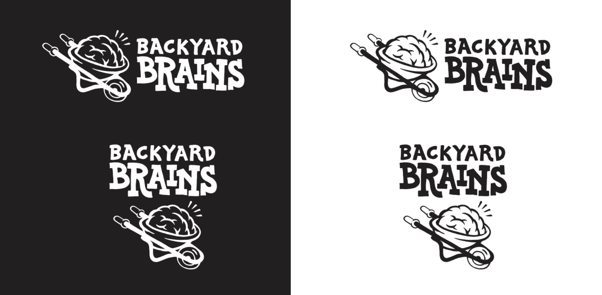
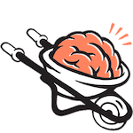
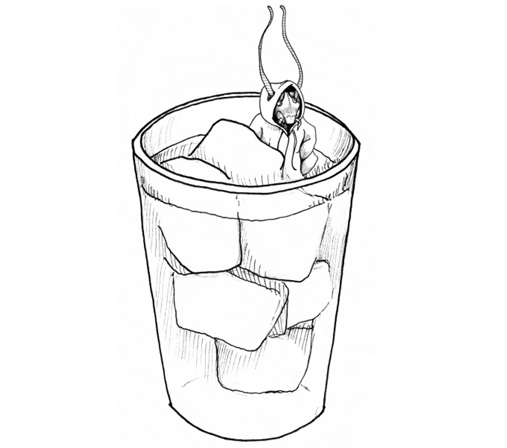
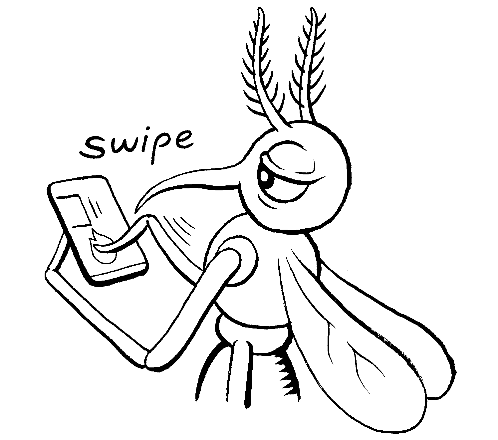

# Style Guide

## Overview

Backyard Brains is on a mission: to make neuroscience more accessible for everyone. We make tools for the home and classroom to help everyone understand more about how the brain works. By using simple DIY tools, hands-on learning, easy to understand language and comic illustrations we make science fun for new audiences.

This new brand identity and accompanying communication design guidelines highlights our playful personality while setting some standards for clear and effective messaging.

## Personality and Voice

### SMART AND FUNNY
Humor is an important part of our brand voice, we make "serious" science fun and accessible and aren't afraid to look a little silly if it gets people more engaged in what we're passionate about.
### ORIGINAL
We tweet not re-tweet. Backyard Brains are content makers, leaders not followers. There is an emphasis on craft and quirkiness in all our outputs from custom illustrations and typography to DIY, open source creation.
### ACCESSIBLE
Our expert team of scientists is on a mission to get learning out of the lab and into more informal settings where anyone can have a go at doing hands-on experiments. We work with all ages and use language that is
simplified without being dumbed down.

### Backyard Brains is not:
- ivory tower or pedantic
- top-down or passive
- homogenous or bro-culture
- clip art, stock house or mass production

## Our Logo

### Mark Development

Our mark is the product of months of working with and an artist and designer to capture and refine the unique identity of Backyard Brains.

### Logo Usage

The Backyard Brains logo consists of hand-drawn type and illustation. It has a playful, humorous character that expresses science + fun.

The full color version is the primary style to apply for white or branded color backgrounds. Depending on the format both horizontal and stacked versions are supplied.

Download sizes:
- [Small (150px)](./BYBLogoFull_150.png)
- [Medium (512px)](./BYBLogoFull_512.png)
- [Large (1024px)](./BYBLogoFull_1024.png)
- [Extra Large (3000px)](./BYBLogoFull_3000.png)

### Monochrome Logo

The monotone version can be applied in instances where the logo needs to be a single color or material - such as a stamp or knocked out from a dark background.

The Backyard Brains logo is our primary brand identifier. To maintain its visual impact and legibility:

- Always maintain clear space around the logo equal to the height of the "B" in "Brains"
- Never stretch, distort, or alter the logo's proportions
- Use only approved color variations
- Ensure the logo is clearly visible against its background

### Icon Only

The neuron icon can be used independently when space is limited or for social media avatars, favicons, and other compact applications.

Download sizes:
- [Small (150px)](./BYBLogo_150.png)
- [Large (1200px)](./BYBLogo_1200.png)

## Brand Colors

Our color palette is carefully chosen to represent different product categories while maintaining brand consistency.

### Primary Colors

| Color Name | Hex Code | Product Category | Usage |
|------------|----------|------------------|--------|
| White | #FFFFFF | All | Backgrounds, illustrations |
| Black | #000000 | All | Text, illustrations |
| Ambiguous Orange | #FD8164 | All | Accent, color pops, Neuroscience callouts |
| Neurogenta | #D01BA4 | Neuron | Accent, color pops for Neuron product line/educational content |
| Simpsonish Yellow | #FEC52E | Human | Accent, color pops for Human product line/educational content |
| Golgi Green | #18A953 | Plant | Accent, color pops for Plant product line/educational content |
| Broca Blue | #1996FC | Neural Engineering | Accents for engineering/coding products/educational content |

### Support Colors

| Color Name | Hex Code | Product Category | Usage |
|------------|----------|------------------|--------|
| Tinted Support Orange 1 | #FFCDBE | All | Used to support the main brand color when multiple tints are needed |

## Illustration Style

Our illustration style has a hand-drawn, sketch-like quality that blends scientific accuracy with a playful, surreal aesthetic. It maintains a balance between informative and expressive, making complex concepts more accessible and engaging.

We hire multiple illustrators to create a consistent style. Here are some examples from our most:

| Cristina Mezuk | Matteo Farinella |
|-----------------|-------------------|
|  |  |

While each illustrator has their own unique style, they all follow the same guidelines.

### Look & Feel
- Minimalist & High-Contrast: The illustrations primarily use black linework on a white background, with minimal color accents. They rely on bold, clean strokes without excessive detail, ensuring clarity even in intricate concepts.
- Hand-Drawn & Organic: The linework feels intentional but loose, avoiding rigid precision. It has an intuitive, scientific notebook-meets-comic book quality.
- Hashes, No Fills: Never use fills in illustrations. Used hashed lines to indicate shading.
- Conceptually Driven: Many illustrations communicate abstract ideas visually, using metaphors, simplified forms, and symbolic elements rather than hyper-literal depictions.
- Slightly Surreal & Playful: While rooted in science, the illustrations introduce unexpected, often humorous twists—like insects using human technology or neural processes represented as physical interactions.
- Dynamic & Expressive: Subjects often have exaggerated gestures, directional lines, and movement cues, making even static images feel lively.
- Scientific Meets Whimsical: Whether it's a neuron with personality or an insect engaged in human-like behavior, the style maintains a balance between technical insight and creative storytelling.

### Common Motifs
- Anthropomorphized Insects & Creatures: Insects and animals often take on human-like traits or interact with technology, reinforcing neuroscience themes in a relatable, engaging way.
- Hand-Written Text: Never use computer-generated text in illustrations.
- Schematic & Geometric Elements: Some illustrations incorporate scientific diagram-like features without becoming rigid technical drawings.

