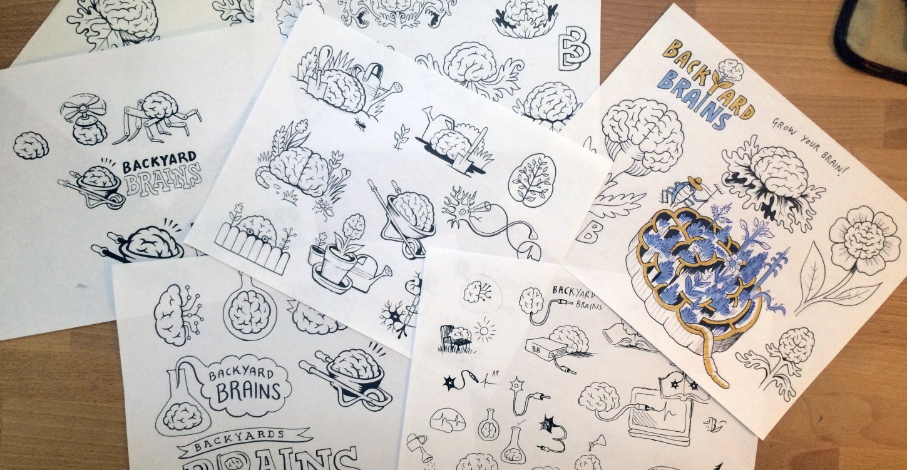
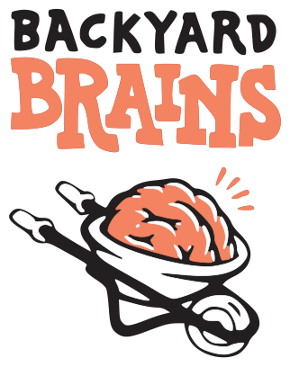
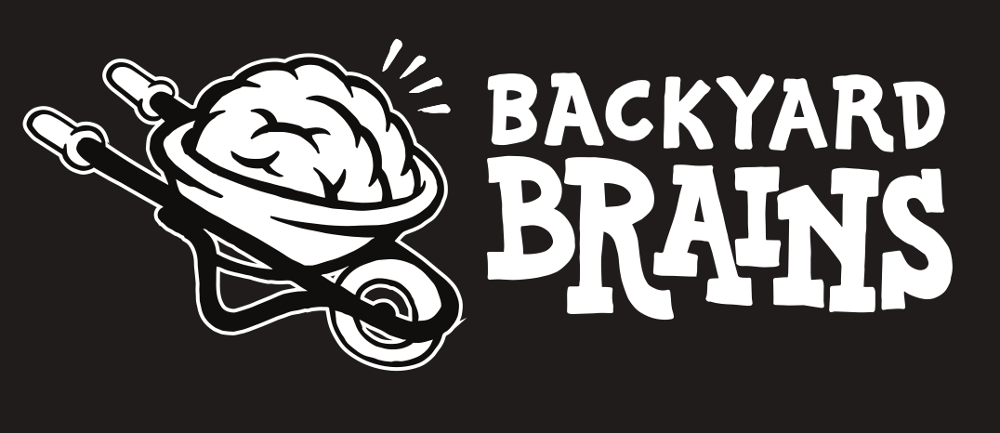
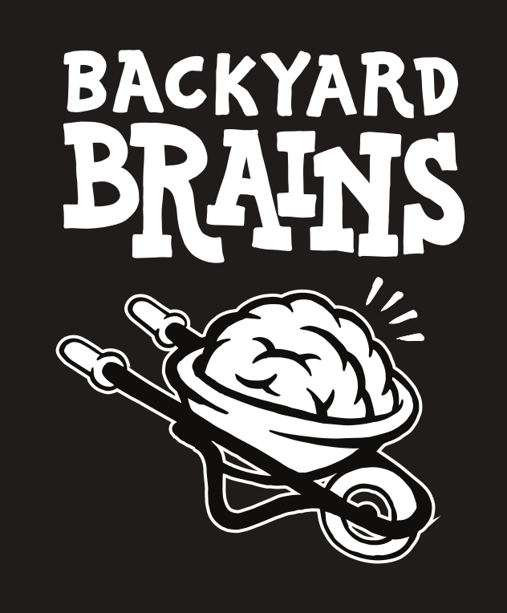
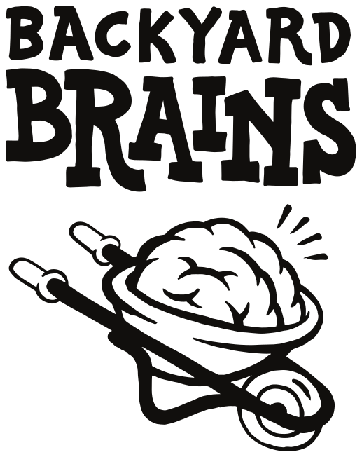
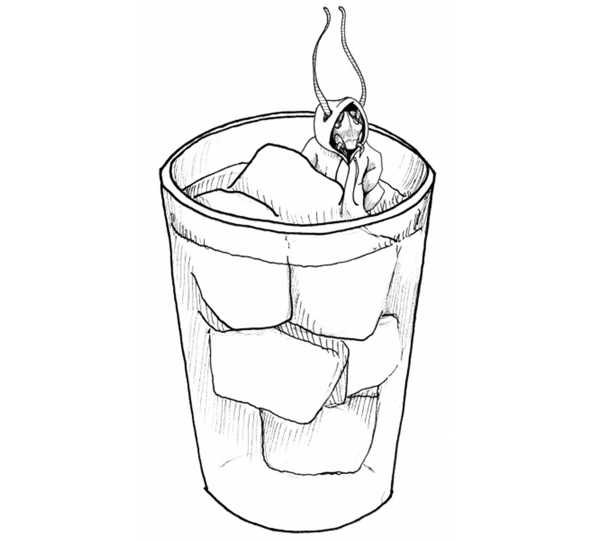

# Style Guide

## Overview

Backyard Brains is on a mission: to make neuroscience more accessible for everyone. We make tools for the home and classroom to help everyone understand more about how the brain works. By using simple DIY tools, hands-on learning, easy to understand language and comic illustrations we make science fun for new audiences.

These brand guidelines highlight our playful personality while setting standards for clear and effective communication.

## Personality and Voice

Our voice should make neuroscience feel inviting without making it feel trivial. These three principles guide how we write, teach, and design.

### Smart and funny

Make serious science enjoyable.

Use humor to open the door to complex ideas. We are willing to look a little silly when it helps people engage, but the science stays accurate.

### Original

Create, don't imitate.

We make our own content and lead with curiosity. Favor handmade illustrations, distinctive typography, open-source thinking, and the practical character of DIY science.

### Accessible

Invite everyone in.

Move learning beyond the lab. Write for curious people of all ages in clear, welcoming language—simple enough to understand, never dumbed down.

### What we avoid

Keep the voice curious, generous, and human. Avoid:

- Ivory-tower language or pedantry
- Top-down instruction or passive participation
- Homogeneity or bro culture
- Generic stock imagery or mass-produced polish

## Our Logo

### Mark Development

Our mark is the product of months of work with an artist and designer to capture and refine the unique identity of Backyard Brains.

### Logo Usage

The Backyard Brains logo consists of hand-drawn type and illustration. It has a playful, humorous character that expresses science + fun.

The full color version is the primary style to apply for white or branded color backgrounds. Depending on the format both horizontal and stacked versions are supplied.

#### Download Images

| Format / Size | Horizontal | Stacked / Vertical |
|---------------|------------|--------------------|
| Vector (SVG) | [Download](./BYBLogoFull_Vector.svg) | [Download](./BYBLogo_Vertical_Vector.svg) |
| Vector (PDF) | [Download](./BYBLogoFull_Vector.pdf) | [Download](./BYBLogo_Vertical_Vector.pdf) |
| Small (150px PNG) | [Download](./BYBLogoFull_150.png) | [Download](./BYBLogo_Vertical_150.png) |
| Medium (512px PNG) | [Download](./BYBLogoFull_512.png) | [Download](./BYBLogo_Vertical_512.png) |
| Large (1024px PNG) | [Download](./BYBLogoFull_1024.png) | [Download](./BYBLogo_Vertical_1024.png) |
| Extra Large (3000px PNG) | [Download](./BYBLogoFull_3000.png) | [Download](./BYBLogo_Vertical_3000.png) |

### Monochrome Logo

The monotone version can be applied in instances where the logo needs to be a single color or material - such as a stamp or knocked out from a dark background.

#### Download Images

| Color Version | Horizontal | Stacked / Vertical | Icon |
|---------------|------------|--------------------|------|
| Black for light backgrounds | [SVG](./BYBLogoFull_Monochrome_Black.svg) · [PDF](./BYBLogoFull_Monochrome_Black.pdf) | [SVG](./BYBLogo_Vertical_Monochrome_Black.svg) · [PDF](./BYBLogo_Vertical_Monochrome_Black.pdf) | [SVG](./BYBLogo_Monochrome_Black.svg) · [PDF](./BYBLogo_Monochrome_Black.pdf) |
| White on approved dark background | [SVG](./BYBLogoFull_Monochrome_White.svg) · [PDF](./BYBLogoFull_Monochrome_White.pdf) | [SVG](./BYBLogo_Vertical_Monochrome_White.svg) · [PDF](./BYBLogo_Vertical_Monochrome_White.pdf) | [SVG](./BYBLogo_Monochrome_White.svg) · [PDF](./BYBLogo_Monochrome_White.pdf) |

#### All Variants

[Download all color and monochrome logo variants (9-page vector PDF)](./BYBLogos_All_Variants.pdf)

[Download the monochrome comparison demo (SVG)](./byb_logo_monochrome.svg)

### Icon Only

The neuron icon can be used independently when space is limited or for social media avatars, favicons, and other compact applications.

#### Download Images

| Format / Size | Icon |
|---------------|------|
| Vector (SVG) | [Download](./BYBLogo_Vector.svg) |
| Vector (PDF) | [Download](./BYBLogo_Vector.pdf) |
| Small (150px PNG) | [Download](./BYBLogo_150.png) |
| Medium (512px PNG) | [Download](./BYBLogo_512.png) |
| Large (1024px PNG) | [Download](./BYBLogo_1024.png) |
| Extra Large (3000px PNG) | [Download](./BYBLogo_3000.png) |

### Clear Space and Minimum Size

The logo needs room to remain recognizable. Keep other text, images, and page edges outside the clear-space area.

  

    Clear space
    <strong>1 × “B” height</strong>
    On every side of the logo
  

  

    Horizontal logo
    <strong>1 in / 25.4 mm wide</strong>
    Minimum print size
  

  

    Stacked logo
    <strong>0.5 in / 12.7 mm wide</strong>
    Minimum print size
  

For digital work, choose the horizontal or stacked version only when every letter remains legible. Use the icon at smaller sizes.

### Logo Use and Misuse

  

    <h4>Use</h4>
    <ul>
      <li>Full-color logos on uncluttered white or light backgrounds</li>
      <li>White monochrome logos on the approved dark background</li>
      <li>Original proportions, spacing, type, and arrangement</li>
      <li>Only the approved color and monochrome files supplied here</li>
    </ul>
  

  

    <h4>Avoid</h4>
    <ul>
      <li>Busy photographs, patterns, or backgrounds with poor contrast</li>
      <li>Stretching, rotating, rearranging, adding, or removing elements</li>
      <li>Recreating the lettering or setting the name on one line</li>
      <li>Drop shadows, blurs, outlines, gradients, or unapproved colors</li>
    </ul>
  

## Brand Colors

Our color palette is carefully chosen to represent different product categories while maintaining brand consistency.

### Primary Colors

| Color Name | Hex Code | Product Category | Usage |
|------------|----------|------------------|--------|
| White | #FFFFFF | All | Backgrounds, illustrations |
| Black | #000000 | All | Text, illustrations |
| Ambiguous Orange | #FD8164 | All | Accent, color pops, Neuroscience callouts |
| Neurogenta | #D01BA4 | Neuron | Accent, color pops for Neuron product line/educational content |
| Simpsonish Yellow | #FEC52E | Human | Accent, color pops for Human product line/educational content |
| Golgi Green | #18A953 | Plant | Accent, color pops for Plant product line/educational content |
| Broca Blue | #1996FC | Neural Engineering | Accents for engineering/coding products/educational content |

### Support Colors

| Color Name | Hex Code | Product Category | Usage |
|------------|----------|------------------|--------|
| Tinted Support Orange 1 | #FFCDBE | All | Used to support the main brand color when multiple tints are needed |

## Typography

Typography should be clear first and characterful second. The hand-drawn voice is most effective when it contrasts with simple, highly legible supporting type.

  

    Workhorse type
    <h3>Roboto</h3>
    
Use for body copy, navigation, documentation, captions, and interface text. Prefer sentence case for prose and title case for headings and menus.

  

  

    Display type
    <h3>Hand-drawn lettering</h3>
    
Use for short product names, campaign titles, and expressive moments. All caps belongs here—not in navigation or long passages.

  

  

    Inside illustrations
    <h3>Hand-lettered notes</h3>
    
Use concise hand-lettered captions, labels, and speech bubbles. Keep paragraphs and detailed explanations in the surrounding body text.

  

### Custom Lettering Principles

- Draw imperfect, human lines rather than digitally perfect geometry
- Favor bold, blocky letterforms with custom ligatures or nested letters
- Avoid outlines, rendered shading, and decorative effects
- Keep display lettering short; never use it for multi-paragraph text

## Layout and Composition

Build a clear hierarchy, use the current brand colors for purposeful accents, and leave generous white space around important content.

  

    1
    <h3>Show, don't tell</h3>
    
Lead with an image, experiment, or result. Keep supporting text concise.

  

  

    2
    <h3>Let elements breathe</h3>
    
Use open, uncluttered layouts with enough space to make the hierarchy obvious.

  

  

    3
    <h3>Keep it in the family</h3>
    
Make related materials feel like one system through consistent type, spacing, illustration, and color.

  

## Illustration Style

Our illustration style has a hand-drawn, sketch-like quality that blends scientific accuracy with a playful, surreal aesthetic. It maintains a balance between informative and expressive, making complex concepts more accessible and engaging.

We hire multiple illustrators who work within a shared visual language. Here are examples from two contributors:

| Cristina Mezuk | Matteo Farinella |
|-----------------|-------------------|
|  |  |

While each illustrator has their own unique style, they all follow the same guidelines.

### Look & Feel
- Minimalist & High-Contrast: The illustrations primarily use black linework on a white background, with minimal color accents. They rely on bold, clean strokes without excessive detail, ensuring clarity even in intricate concepts.
- Hand-Drawn & Organic: The linework feels intentional but loose, avoiding rigid precision. It has an intuitive, scientific notebook-meets-comic book quality.
- Hatching, No Fills: Never use solid fills in illustrations. Use hatched lines to indicate shading.
- Conceptually Driven: Many illustrations communicate abstract ideas visually, using metaphors, simplified forms, and symbolic elements rather than hyper-literal depictions.
- Slightly Surreal & Playful: While rooted in science, the illustrations introduce unexpected, often humorous twists—like insects using human technology or neural processes represented as physical interactions.
- Dynamic & Expressive: Subjects often have exaggerated gestures, directional lines, and movement cues, making even static images feel lively.
- Scientific Meets Whimsical: Whether it's a neuron with personality or an insect engaged in human-like behavior, the style maintains a balance between technical insight and creative storytelling.

### Common Motifs
- Anthropomorphized Insects & Creatures: Insects and animals often take on human-like traits or interact with technology, reinforcing neuroscience themes in a relatable, engaging way.
- Hand-Written Text: Never use computer-generated text in illustrations.
- Schematic & Geometric Elements: Some illustrations incorporate scientific diagram-like features without becoming rigid technical drawings.

### Illustration Guardrails

  

    <h4>Use</h4>
    <ul>
      <li>Humorous metaphors and expressive, anthropomorphized characters</li>
      <li>Sketchy hand-drawn lines with simple, memorable forms</li>
      <li>Clear experiment diagrams with minimal captioning</li>
      <li>Primarily black-and-white line art with restrained current-color accents</li>
    </ul>
  

  

    <h4>Avoid</h4>
    <ul>
      <li>Highly rendered textbook realism</li>
      <li>Complex scenes, extraneous details, heavy shading, or solid fills</li>
      <li>Long labels that should live in the accompanying text</li>
      <li>Generic stock art or digitally perfect linework without character</li>
    </ul>
  

