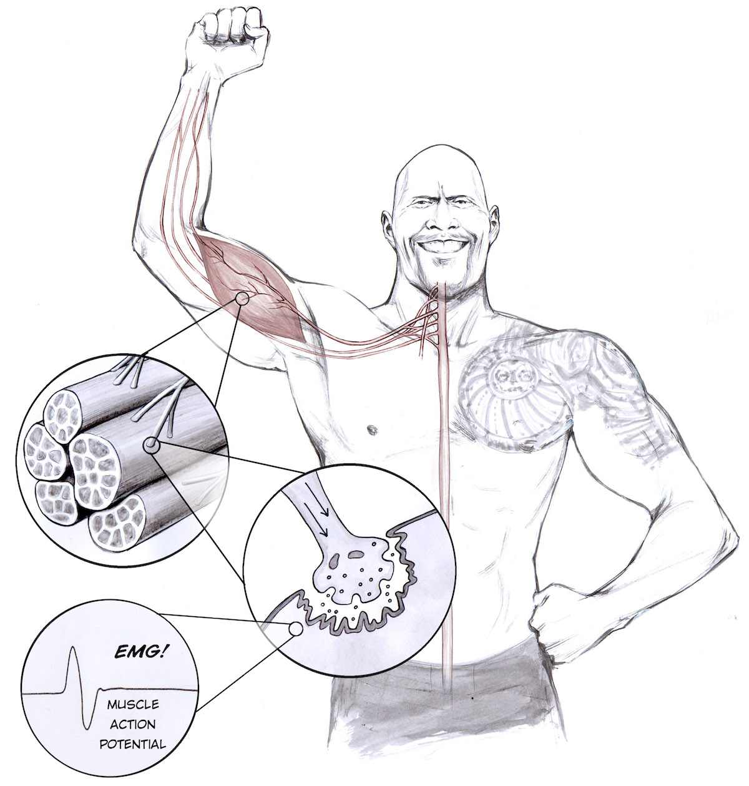
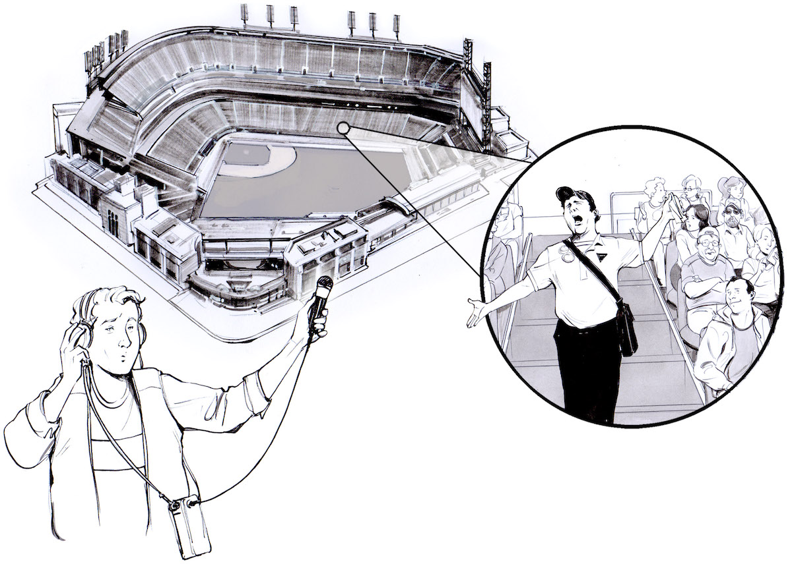
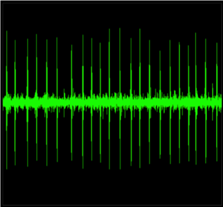
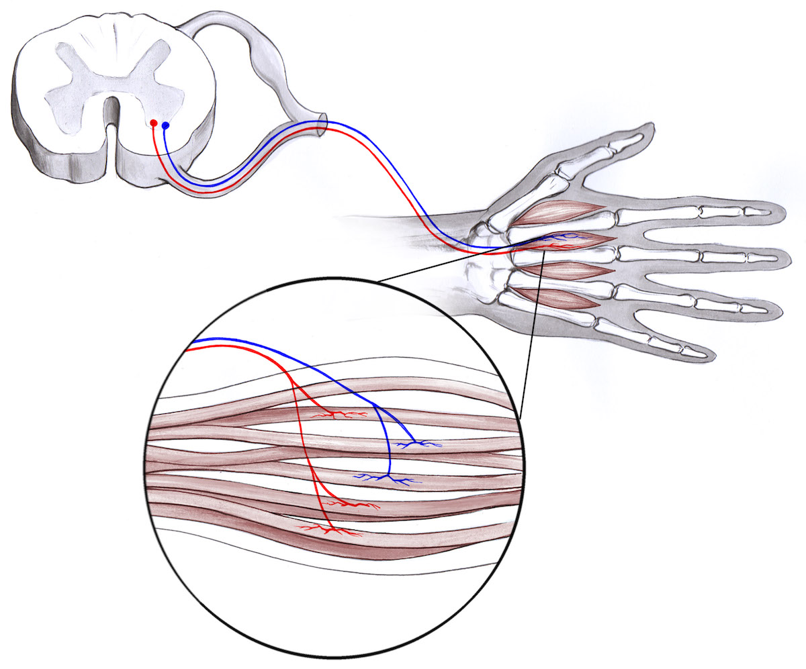

**Time:**  30 Minutes

**Difficulty:**   Intermediate

#### What will you learn?

In this experiment we will be on the hunt for the elusive Single Motor Unit.
By detecting the activity of only one motor unit, we are getting a glimpse of
the activity of a single neuron. That's right-you can use the Muscle SpikerBox
to record the discharge of a single motor neuron in your body, if you are
patient and creative enough to complete the hunt.

##### Prerequisite Labs

* [Record Electricity from your Muscles](./muscleSpikerBox.md) - You should read this experiment first to learn about electromyography and motor units.
  * [Muscle Action Potentials](muscleactionpotential.md) - You should be familiar with using the small popsicle stick electrodes to record muscle action potentials.

##### Equipment

* [Muscle SpikerBox Bundle](https://backyardbrains.com/products/muscleSpikerboxBundle)

## Background

_Based on experiments and writing by Colorado State University student Breonna
E. Holland, Associate Professor[Brian L.
Tracy](https://www.hes.chhs.colostate.edu/faculty-staff/tracy.aspx), and CSU's
[Muscles Alive!](https://www.facebook.com/MusclesAliveCSU/) outreach program._

In several other experiments, we talked about the motor unit - a single motor
nerve cell, or motor neuron, and all of the muscle fibers that the neuron
innervates. Saying it's a motor neuron tells us that it sends messages out
from the spinal cord to control muscles. It isn't the kind of neuron (a
sensory neuron) that sends messages to the spinal cord and helps us feel
things.

Motor neuron axons have special synapses with muscles called [neuromuscular
junctions](https://en.wikipedia.org/wiki/Neuromuscular_junction) that release
the neurotransmitter
[acetylcholine](https://en.wikipedia.org/wiki/Acetylcholine) onto muscle cells
to activate them, causing muscle fiber action potentials. This is what we see
in the electromyography (EMG) signal - the muscle fibers of a motor unit
firing action potentials in response to the acetylcholine!

In healthy physiology, a single action potential in a neuron always causes a
single action potential in the accompanying muscle fibers. If we are able to
recruit only one motor unit that is under our electrodes, this pattern allows
us to see the single neuron's output on the muscle fibers using our Muscle
SpikerBox amplifier. A single muscle contains many motor units (~100 - 5,000)
thus, when you flex, many motor neurons are activated, causing many action
potentials in the accompanying muscle fibers, which is why we hear the
characteristic "whoosh" sound when we use the Muscle SpikerBox. Think about
standing outside an arena when the home team scores - you hear a big roar, but
you can't hear any one of the many individuals.

How could we hear just one of those people? Sit in the seat next to them,
right? In a human muscle, that would require a visit to a fancy neuroscience
research lab, where we could stick a fine wire electrode directly into a
muscle using a hypodermic needle, so that the tip of the fine wire is very
close to the muscle fibers belonging to one motor neuron. This is NOT very
practical for the do-it-yourself neuroscientist. Ouchy.

But what if you got lucky when you entered the arena and there was one person
shouting very loudly that you could hear from far away? When the crowd is
quiet, you may able to hear the individual person, but you would have to move
around the stadium to eventually hear him - kind of like hunting for a single
motor unit from above the skin. So here we are, on the hunt for single motor
unit action potentials using our Muscle SpikerBox and popsicle-stick
electrodes.

A single motor unit produces repeated spikes (action potentials) about five to
twenty times per second. They are pretty regular, and if you find a good one
it will be clearly different than the background noise and will produce a
regular popping noise in the audio output. If you keep the electrode position
stable, the amplitude of the spiking will remain stable. It will look
something like this_

Notice the repeated pattern of amplitude and spacing between the spikes. This
regular pattern is how we can be sure it is a single motor unit. The quest is
worth it! If you succeed, you are listening to the cellular discharge behavior
of a single motor nerve cell from your own central nervous system.

#### Downloads

> Before you begin, make sure you have the [Backyard Brains Spike
> Recorder](https://backyardbrains.com/products/spikerecorder) installed on
> your computer/smartphone/tablet. The Backyard Brains Spike Recorder program
> allows you to visualize and save the data on your computer when doing
> experiments. We have also built a simple lab handout to help you tabulate
> your data.
>
> [Spike Recorder Computer
> Software](https://backyardbrains.com/products/spikerecorder)
>
> [Class
> Handout](./files/Hunt_for_Motor_Unit_handout.pdf)

## Video

## The Safari, The Experiment

In this experiment, we are going to try to isolate individual motor units of
the interossei muscles of the hand and the temporalis muscle of the jaw.

  1. Set up your Muscle SpikerBox Pro using a smartphone or computer with the Spike Recorder app. Make sure the red leads are attached to the metal tabs on the popsicle sticks and the black ground is around the screw you will gripping with your hand. Add conductive gel to the metal tabs attached to the red alligator clips.
  2. Connect the USB cable from the the Muscle SpikerBox Pro to the computer. Open Spike Recorder, and turn on your Muscle SpikerBox Pro. A USB icon should appear on the main SpikeRecorder screen. Click on it to connect to your Muscle SpikerBox Pro. (Note_ If you are using a tablet, smartphone, and/or a Regular Muscle SpikerBox, you can connect to your tablet/smartphone/computer with the green smartphone audio cable. 
  3. Place the electrodes over the back of your hand between the knuckles as shown in our [Muscle Action Potentials](https://backyardbrains.com/experiments/muscleactionpotential) experiment. 
  4. Have your friend place a pen or pencil(eraser side down) adjacent to your middle finger. Have your friend veeeeeeeeerrrrrryyyyyy gently try move your finger with the pencil with a minimum of force. 
  5. Now resist the pressure of the pencil oh so gently. You should begin hearing the distinct "pop" sound of an individual motor neuron causing its accompanying muscle fibers to discharge. This is a challenging experiment in self-control! To ensure the best possible conditions, try to do this experiment in a room that is relatively quiet in both ambient sound and ambient electrical noise. You can also try hooking up a secondary "louder" battery-powered speaker using the Backyard Brains blue audio cable that comes with your gear. This may help hear the faint individual popping of individual motor units.
  6. If you are finding trouble getting only one motor unit to fire in your hand, you can try another muscle, the temporalis of your jaw. 

  7. Feel the side of your temple as you make chewing motions, this muscle (very visible on thin people when they chew gum) is your temporalis. Place your popsicle stick electrodes over this muscle.
  8. Close your jaw, bringing your upper and lower teeth together, but not applying force.
  9. Now, try to enter a type of "body awareness zen" and think about clenching your jaw muscles ever....so...slightly...barely even thinking of moving your muscles. 
  10. Listen and watch carefully for repeated spiking on the screen and regular popping in the audio. If you can't get good motor unit isolation on hand or temple muscles, try on other muscles you think may have good control over. Try different locations on the same muscles, different muscles, different between-electrode distances. Get out your anatomy book or Google images and learn some new muscle anatomy.
  11. Make some recordings of good single motor units. Can you change the rate of firing with your thoughts? Can you measure the rate of firing (action potentials/sec) with careful use of the app? You can "SpikeSort" in the app to get a good measure of firing rate. You can easily often see 2-3 motor units, but can you isolate an individual motor unit? You can see in the video above it was challenging for us too! Happy Hunting!

## Science Fair Project Ideas

* What does single muscle unit activity look like on different parts of your body? Are they different at all? Why or why not? Does muscle action potential amplitude ever change?
* Neurons often "spike" even when they don't seem to be actively transmitting signals, a phenomenon known as basal activity. Try recording from an "inactive" muscle (one you keep relaxed) for a while-does there seem to be basal spiking? Why do you think there is or isn't? Does basal activity presence or frequency change with different muscles? We have also basal activity of the hand interossei muscles is different in different people. Some people have zero basal activity, some have high firing even at rest! Maybe they recently had a cup of coffee? Investigate for yourself!
* Why do you think it's so difficult to find a single motor unit or single motor action potential? What does this say about human muscle anatomy and physiology? 

## Notes

If you have our very first original Muscle SpikerBox with 3 separate leads
(not a single orange cable), the colors of the alligator clips are different.
The Red and Black clips should go around the metal tabs on the popsicle
sticks, while the white clip goes around the screw you are gripping with your
hand.
