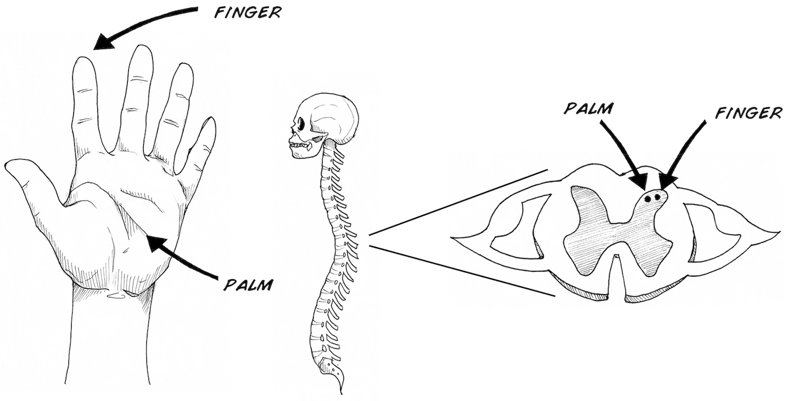
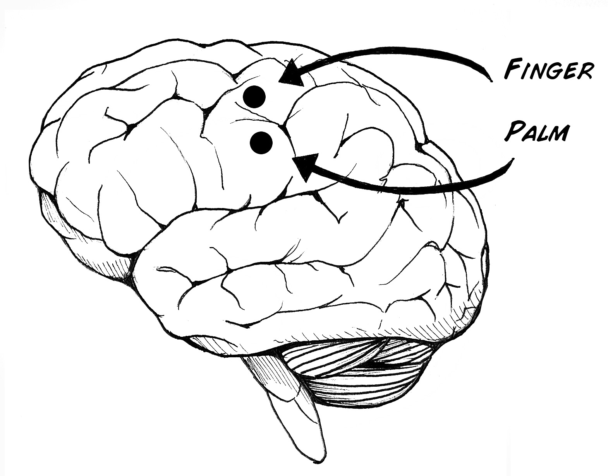
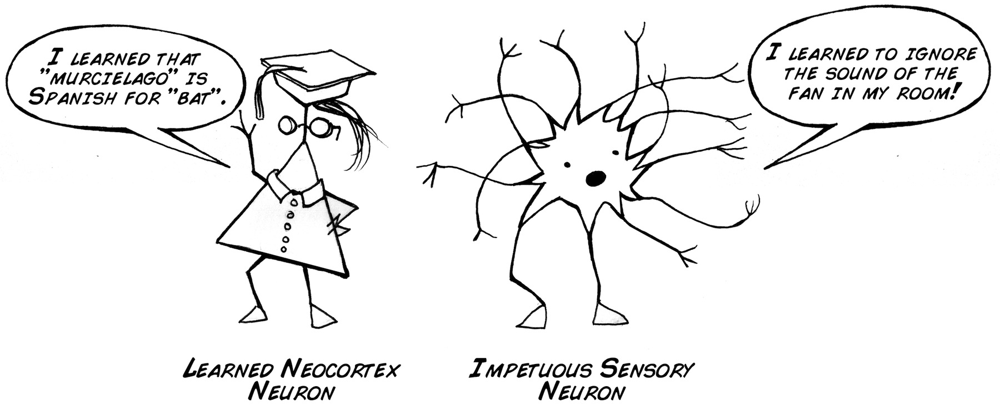
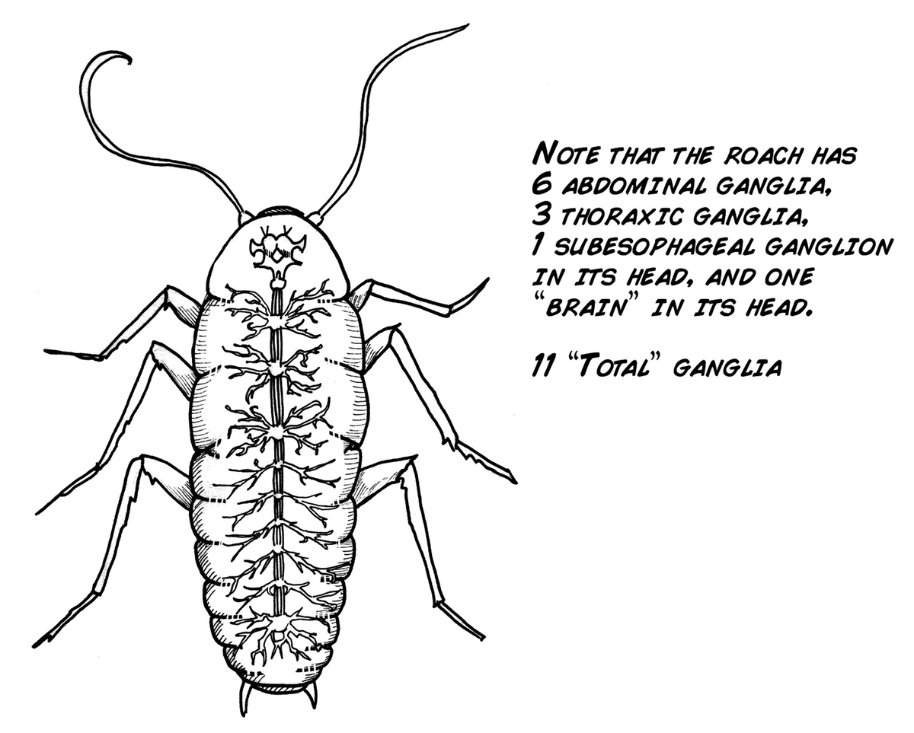
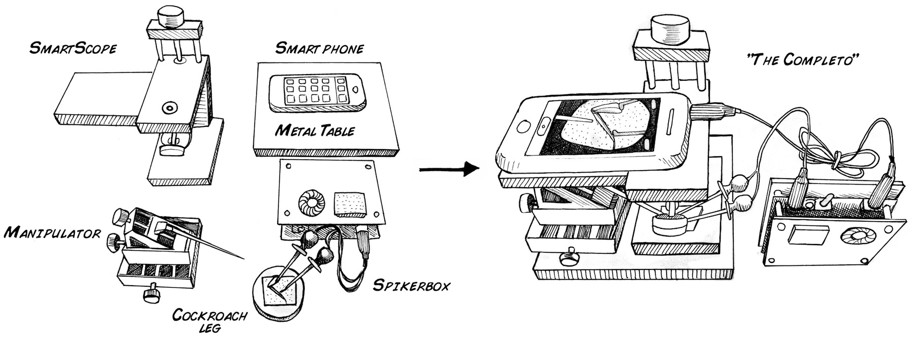
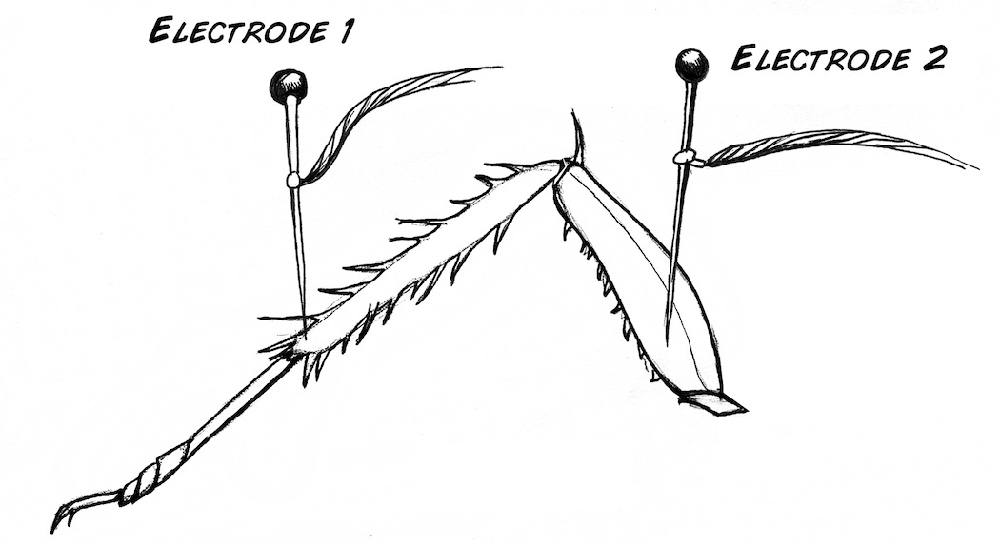
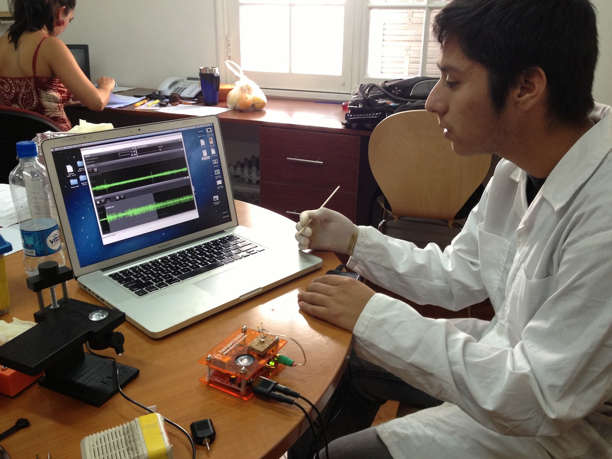

Neurons learn, and you will gain a first look at this by examining a sensory neuron's adaptation to a constant stimulus.

**Time:**  45 Minutes

**Difficulty:**   Intermediate

#### What will you learn?

In this experiment you will be introduced to new types of science equipment
such as manipulators and microscopes, and you will learn that neurons
constantly change their response properties.

##### Prerequisite Labs

* [SpikerBox](./ratecoding.md) - You should become familiar with how to use your SpikerBox.

##### Equipment

[The Completo](https://backyardbrains.com/products/Completo)

* * *

## Background

The spatial arrangement of your body has strikingly similar organization in
your brain. For example, you have touch receptors in your fingers and palm
that synapse with neurons that go to specific parts of the spinal cord...

...that then synapse with specific parts of the brain on up to the neocortex
(wrinkly part of the brain).

These are exquisite maps of your body, and you have many of these, such as
maps for visual fields, hearing space, the position of your limbs, and more.
But, as you know from [our human behavioral experiments](skin), over time your body
gets used to stimuli. You are probably aware of the clothes on your body the
moment you put them on, but rather quickly you unconsciously ignore the
constant presence of cloth on your skin.

We can argue the chief responsibility of a neuron is to "learn," or change its
response properties depending on the conditions it faces.

You brain learns, and it learns quickly. That's what it does. This can happen
over the long term (learning to speak a different language) and over the short
term (learning to ignore background noise).

Though the mechanisms of learning are still a subject of healthy and active
research (for example, we still do not know how [declarative memory is stored
in the brain](https://www-personal.umich.edu/~tmarzull/hippocampus/High_Resolution/Original_HowManyNeurons_HighRes.pdf)),
we can investigate this short term effect of "adaptation" using the cockroach
leg preparation.

The cockroach has a peripheral system, where neural input from its limbs is
transmitted to its central nervous system of ganglia along its ventral nerve
cord.

You may think sensory adaptation occurs at the ganglia level, but it can
actually happen in the first sensory neuron! We will measure this adaptation
effect by carefully manipulating the touch sensitive barbs on the cockroach
leg.

For this experiment, we need to precisely place fine wooden probes directly on
the sensory barbs of the cockroach under magnification, so we will need to use
our [Manipulator](https://backyardbrains.com/products/micromanipulator) and
[RoachScope](https://backyardbrains.com/products/roachscope).

## Video

## Procedure

1. In this experiment, you will be putting a cockroach leg underneath our
[RoachScope](https://backyardbrains.com/products/roachscope). Apply a piece of
cork underneath the lens of the scope, plug the RCA end of your electrode
cable into the SpikerBox, and your needle electrodes into the cockroach leg as
shown below.

2. Turn on the SpikerBox; [as before](https://backyardbrains.com/experiments/spikerbox), you should hear a robust spontaneous spiking activity.

3. Plug in your [Smartphone cable](https://backyardbrains.com/products/smartphonecable) into the SpikerBox
and your SmartPhone. Note_ you may want to [split the output](https://wiki.backyardbrains.com/Giving_Demo%27s_to_Large_Audiences) of
the SpikerBox so that you can hear the spikes at the same time.

4. Turn your smartphone's camera app on and put it in **movie** mode.

5. Now, place a toothpick in your manipulator, and position the toothpick,
with your [manipulator](https://backyardbrains.com/products/micromanipulator),
over a spine on the leg of the cockroach (Note_ you may want to touch the
barbs with a toothpick by hand first to find the barbs that are most
sensitive).

6. With your manipulator, touch the sensitive barbs. You should hear a
massive discharge of spikes that then goes away within a couple seconds. You
can have your labmate time this by hand, or you can [extract the audio recording](https://wiki.backyardbrains.com/Extracting_Audio_Tracks_from_Movies)
from the movie file for more rigorous analysis. You can then measure the
adaptation time using our new "[Backyard Brains Spike Recorder](https://backyardbrains.com/products/spikerecorder)" PC software as
we did in the video above.

7. Repeat with a number of barbs. Do the times for barb "adaptation" differ
among different barbs? Try removing the toothpick and then immediately placing
it back on the barb again. Is the adaptation time quicker or slower?

## Questions/Further Work

1. Do you think certain drugs will lengthen the adaptation time? 
  2. It's not only the barbs that are sensitive to touch, but also the exoskeleton of the leg itself. Try probing different parts of the leg and measuring if the adaptation times are different. 
  3. We can't we do those experiment by hand? Try very precisely positioning the toothpick with your hand, and measuring the adaptation time. It should appear to take much longer. Do you have any ideas as to why this might be so? 

## Acknowledgements

Gracias to Carlos Burgos Gutierrez, high school student at [Liceo Japon](https://liceojaponhuasco.blogspot.com/) in Huasco, Chile, for helping us
collect our first preliminary data for this experiment.

