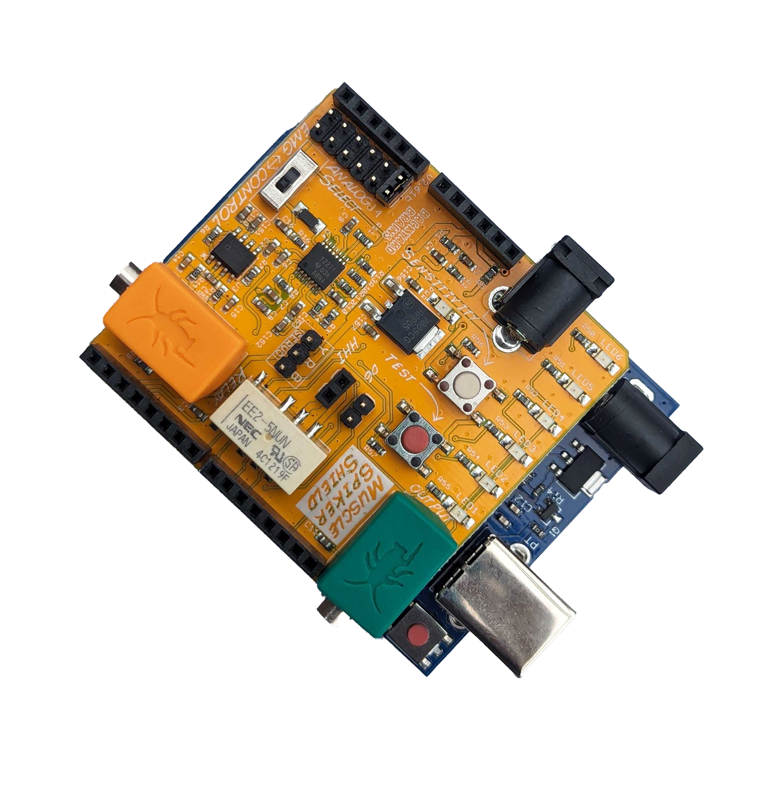
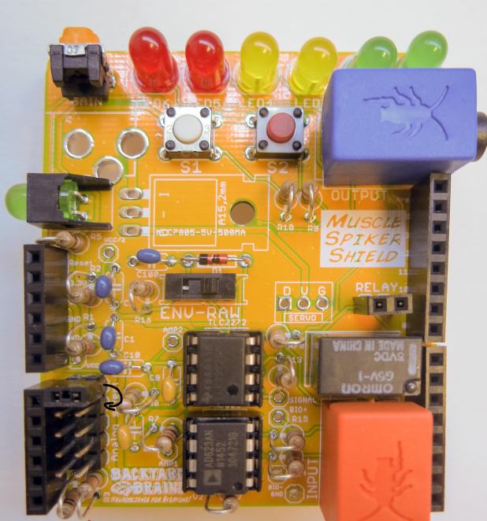

# Muscle SpikerShield #

The Muscle SpikerShield bundle provides a comprehensive set of tools for developing new interface concepts, studying neuroprosthetics, or utilizing muscle activity to create advanced human-machine interfaces. It comes paired with an Arduino UNO board, and motor controll circuitry so that it's functionality can be expanded via both software and hardware. 
It can be used to record and analyze EMG signals, especially when connected to our [Spike Recorder App](https://backyardbrains.com/products/spikerecorder). 

## Getting Started ##

First, connect the Arduino to a power source using the blue USB cable

Now peel the back of the sticker-electrodes and place three of them on your muscle (arm, leg, jaw, etc.). If you choose your biceps, you can do it like shown in the picture below

Connect the EMG leads to the electrode pads and flex as hard as you can! Watch the LEDs decode your EMG activity.

The code on the Arduino is already preloaded so you can controll LEDs, but you can come up with your own experiments and write your own code. Control a light in the house with a move of the leg? or perform a left mouse click by blinking? Why not play packman using your jaw?

Check out our [experiment pages](https://backyardbrains.com/experiments/) for more detailed instructions

Try writing your own code and upload it using the Arduino IDE software.

You can also record and analize your EMG by connecting to our [Spike Recorder software](../../software/spike-recorder/index.md)

## Technical Specifications ##

|||
|---|---|
|Frequency range | 50Hz-2500Hz|
|Gain|600x|
|Output|USB, Green Smartphone Cable, Blue Laptop Cable|
|Inputs|1x [Orange Cable](https://backyardbrains.com/products/muscleElectrodeCable)|

The inputs and outputs can be customized by uploading custom firmware to the Arduino UNO board.

## Experiments ##

[Using the Muscle SpikerShield](https://backyardbrains.com/experiments/emgspikershield)   
[Controlling a Light Bar in an LCD](https://backyardbrains.com/experiments/MuscleSpikerShield_LCD)   
[Controlling a Stepper Motor](https://backyardbrains.com/experiments/MuscleSpikerShield_StepperMotor)   
[Controlling a Gripper Hand](https://backyardbrains.com/experiments/MuscleSpikerShield_GripperHand)   
[Getting Started with Electromyograms (EMGs)](https://backyardbrains.com/experiments/emgspikerbox)   
[Muscle Action Potentials](https://backyardbrains.com/experiments/muscleActionPotential)   
[Muscle Contraction and Fatigue](https://backyardbrains.com/experiments/fatigue)   
[Modeling Muscle Fatigue](https://backyardbrains.com/experiments/rateoffatigue)   

## Stacking ##

One Muscle SpikerShield can measure one channel of EMG.
However, it's possible to stack up to 6 Muscle SpikerShields (or DIY Muscle SpikerShields) on top of a single Arduino board to have multiple EMG channels. 

Before you stack the second shield on top of the first one, move the jumper pin one field below, same principle would apply to each subsequent shield.

Note: The picture is of a DIY Muscle Shield but the same will work for the regular Muscle Shield. 
However, DIY Muscle spikershields don't come with the motor control components, so you couldn't use them for servo or stepper motors.

## Troubleshooting ##

If the power LED is on, but the EMG LED array isn't responding, Let's try a few things:
First let's try pressing the white sensitivity button on the board to cycle through the sensitivity settings, you should see one of the LEDs light up to indicate the sensitivity level.

Let's also try uploading [This Code](https://github.com/BackyardBrains/Muscle-SpikerShield/blob/master/V2_61/Muscle-SpikerShield/Muscle-SpikerShield.ino) to the arduino board, using the Arduino IDE software.

If the correct code is on the arduino board, by far the most common issue with the Muscle SpikerShield is that the pins are not making proper contact with the Arduino. This can cause a wide variety of problems and strange behavior.
The first thing we should try is separating the SpikerShield and Arduino, and bending the pins slightly, [as seen in this video](https://photos.app.goo.gl/8RVNmLtoGAXuQYiv5).
After that, make sure that the SpikerShield is pressed firmly into the Arduino board, and pull very slightly up. 