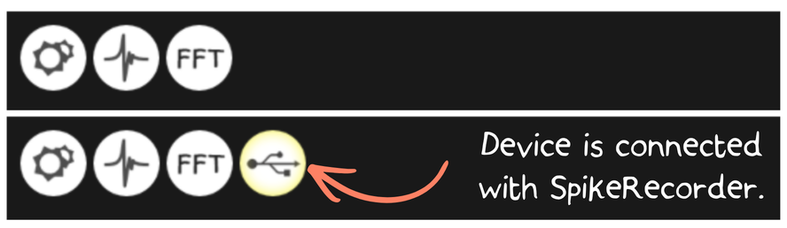
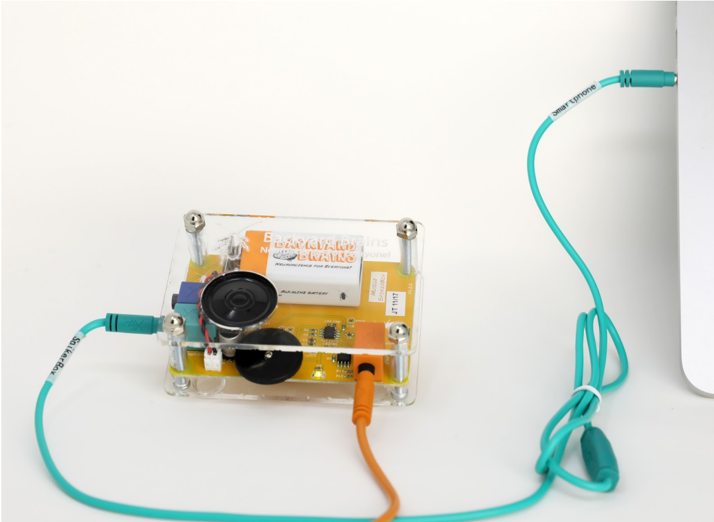
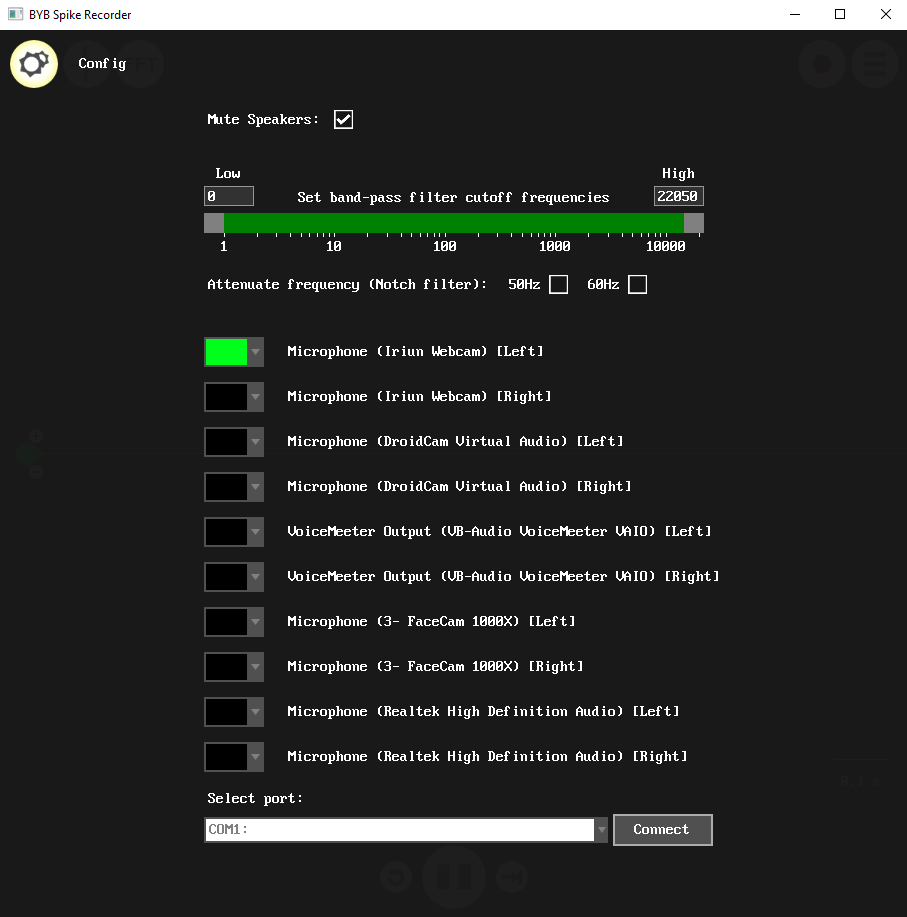
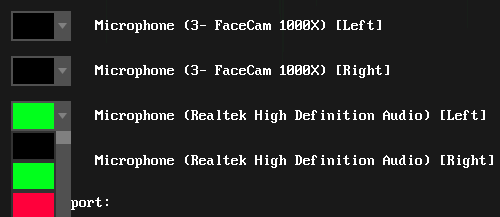

### Spike Recorder Connection Methods

Choosing a connection method depends on your SpikerBox and the device running Spike Recorder.

## USB Connection

Use USB when both your device and platform support a USB connection.

USB is usually the preferred connection method for newer Backyard Brains devices because **Spike Recorder** can recognize the device directly.

Open the **Spike Recorder app**, plug in the **USB cable**, and turn on the **SpikerBox**.

When connected by USB, **Spike Recorder** displays a **USB/device button** near the top-left area of the interface. A highlighted outline around the button indicates that the device is connected.

## Green “Smartphone” Cable Connection

Use the **green “smartphone” cable** for devices with a **combined headphone/microphone port**, such as many laptops and older phones or tablets.

The green cable is **directional**. The end labeled **“SpikerBox”** must go into the **SpikerBox**. The other end labeled **“Smartphone”** goes into the phone, tablet, or computer.

>Note: A generic audio cable will not work. Direct connection to a phone, tablet, or computer through the analog microphone input requires the proper custom cable because the cable routes the SpikerBox signal into the device’s microphone input.

On older versions of **iOS** and **Android** devices, the device usually connects automatically when using the analog cable.

On **desktop**, you may need to manually select the correct audio input in **Spike Recorder**.

After plugging in the green cable:

1. Open the **Config** menu by clicking the small **gear icon** in the top-left corner.
2. Look below the filtering options.
3. You should see a list of available **audio input devices**.

Each input device has a dropdown menu on the left side. This menu controls two things for that input channel: the graph color and whether the channel is active.

Select a visible color, such as **green**, for the external audio input connected to the SpikerBox.

Select **black** for any input channels you want **Spike Recorder** to ignore, such as the computer’s built-in microphone or webcam microphone.

## Blue “Laptop” Cable

Use the [**blue cable**](https://backyardbrains.com/products/laptop-cable) for computers with separate **headphone** and **microphone** ports.

Plug the signal into the **microphone** input, **not** the headphone output.

Setup in **Spike Recorder** is otherwise similar to using the green “smartphone” cable:

1. Open the **Config** screen.
2. Select the correct **audio input channel**.

## Connecting to Other Software

If you are using the blue or green cable to connect your SpikerBox, you can use any program that records audio, such as **Audacity**.

Keep in mind that the Plant SpikerBox, Heart and Brain SpikerBox use amplitude modulation (AM) with a 5 kHz carrier signal. **Spike Recorder** automatically removes this carrier signal.

If you are connecting via USB, you can also load the data directly into your own program. Here are a few resources for setting up your own host software:

* [**Implementation Guide for SpikerBox Host Software**](https://github.com/BackyardBrains/SpikerBoxPro/blob/master/Muscle/documentation/SpikeRecorderHIDspecification.pdf)
* [**Example Python Script**](https://raw.githubusercontent.com/BackyardBrains/SpikeTools/master/spikerecorder.py)