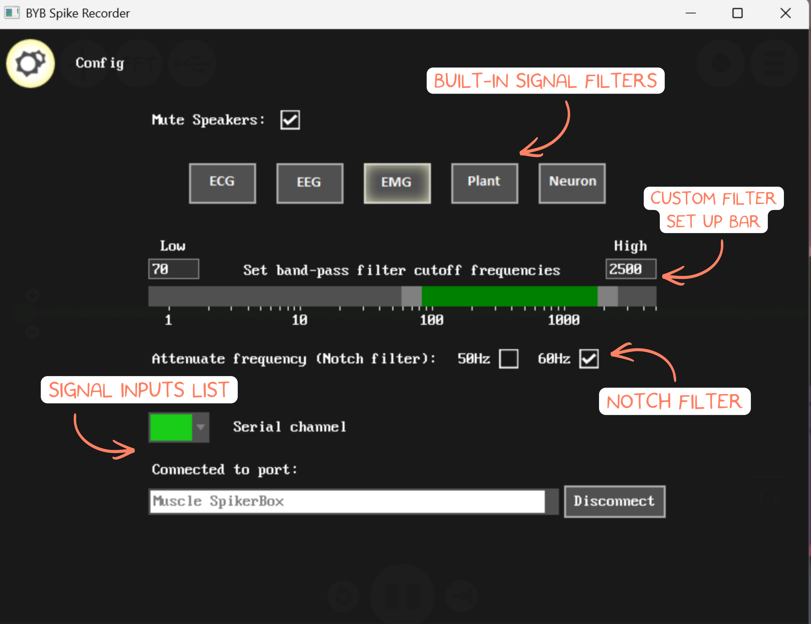

# Spike Recorder for Windows/macOS/Linux #

## Installing and Opening Spike Recorder

### Install on Windows

1. Go to the official [**Backyard Brains Spike Recorder product page**](https://backyardbrains.com/products/spikerecorder).
2. Download the Windows app zip folder.
3. Extract the folder, and open the installer file.
4. Follow the installer prompts.
5. Launch **Spike Recorder** after installation.

### Install on macOS

1. Install Spike Recorder from [**the Mac App Store**](https://apps.apple.com/us/app/spike-recorder/id972173310?mt=12)
2. Open **Spike Recorder**.
3. If macOS asks for microphone or input permission, allow access. **Spike Recorder** needs input access when recording through the computer audio input.

### 3.3 Install on Linux

1. Use the official [**Backyard Brains GitHub repository**](https://github.com/BackyardBrains/Spike-Recorder).
2. Follow the build or run instructions for your Linux distribution.
3. Install required dependencies if building from source.
4. Run **Spike Recorder**.

>Note: Linux setup can be more technical than Windows or macOS setup. Use it when you are comfortable following software build instructions.
___
## Before Opening Spike Recorder

Prepare your Backyard Brains hardware according to the device guide.

1. Install or check the battery.
2. Make sure the device can turn on.
3. Connect the electrodes or experiment leads.
4. Choose a connection method. For detailed connection instructions, see the [**Spike Recorder Connection Methods**](/software/spike-recorder/connection-methods/) page.

## Next Steps

**Configuring inputs:** On desktop **Spike Recorder**:

1. Click the **gear icon** in the upper-left corner.
2. Review the list of available signal inputs.
3. Identify the input connected to your **SpikerBox** or **SpikerShield**.

The input list depends on your computer and connected device. You may see:

* Built-in microphones
* External microphones
* USB devices
* SpikerBox channels
___
**Show or Hide a Channel (for multichanel recording):**

1. In the **Config** screen, find the channel list.
2. Use the color dropdown next to a channel to select a waveform color.
3. Select **black** to ignore or hide a channel.
4. Return to the live view.
___
**Mute Speaker Monitoring:** Some versions of the desktop Config screen include an option to mute sound on the computer speaker during recording.

1. Open the **Config** screen.
2. Find the speaker or monitoring option.
3. Enable **mute** if you do not want to hear the incoming signal from the computer speakers.

This does not stop recording. It only changes whether the signal is played through the computer speaker.

## Set Digital Filters

A filter changes which parts of the signal are displayed or recorded.
___
**Use the Band-Pass Filter:**

1. Open the **Config** screen.
2. Find the filter section.
3. Chose the built-in signal filter, or manually set the low and high cutoff frequency.
4. Confirm that the selected frequency band is applied.
___
**Use the Notch Filter:**

1. Open the **Config** screen.
2. Find the notch filter checkbox.
3. Enable the notch filter.

Use a **50 Hz** or **60 Hz** notch filter to reduce mains electrical noise. The correct value depends on the local power system.

