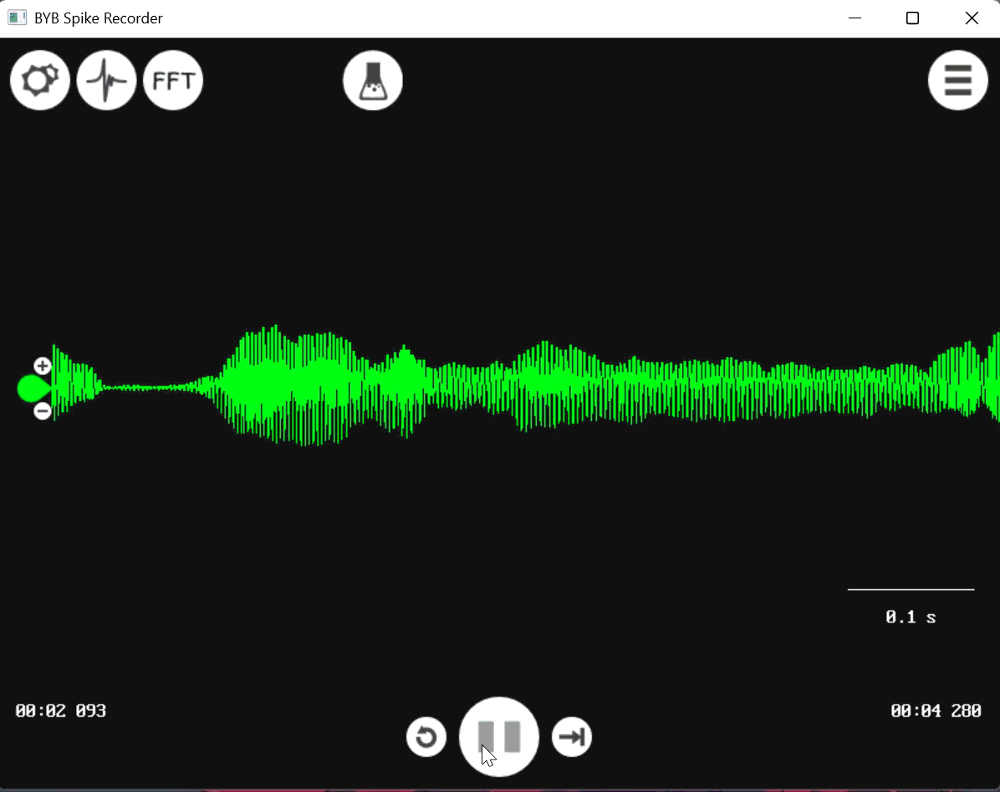

# Spike Recorder #

### What Spike Recorder is

**Spike Recorder** is our free software for viewing, recording, playing back, and analyzing
electrical signals from Backyard Brains devices such as **SpikerBoxes** and **SpikerShields** (*retired*).

Our devices detect small electrical signals from muscles, the heart, the brain, eyes, neurons or plants, depending on the device and experiment. **Spike Recorder** displays those signals as a moving **waveform** on your computer, phone, or tablet.

> Note: A waveform is a line graph that changes over time. In Spike Recorder, the waveform shows the signal coming from your device. 

### **Supported platforms and hardware**

**Spike Recorder** is available for:
1. [Windows](https://backyardbrains.com/products/spikerecorder)
2. [macOS](https://apps.apple.com/us/app/spike-recorder/id972173310?mt=12)
3. [Linux](https://backyardbrains.com/products/spikerecorder)
4. [iOS / iPadOS](https://apps.apple.com/us/app/spike-recorder/id367151200)
5. [Android](https://play.google.com/store/apps/details?id=com.backyardbrains&hl=en)
6. [Web (*in development*)](https://docs.backyardbrains.com/software/spike-recorder/web/)

**Required hardware:** You’ll need a computer/laptop, phone, or tablet that can run **Spike Recorder**. Before choosing which device to use for recording, first check compatibility and available connection types to make sure it will work with your setup.

---

## Next steps

Once you have **Spike Recorder** installed, the next step is connecting your Backyard Brains device and making sure your signal looks right.

* **[Read about connection methods:](https://docs.backyardbrains.com/software/spike-recorder/connection-methods/)**
  Learn the different ways to connect your device to **Spike Recorder**.

* **[Troubleshoot Spike Recorder:](https://docs.backyardbrains.com/software/spike-recorder/troubleshooting/)**
  Having trouble seeing a signal, connecting your device, or getting clean recordings? Start here for common fixes.