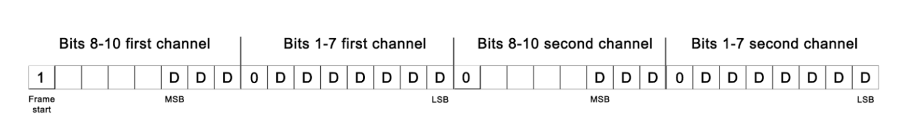
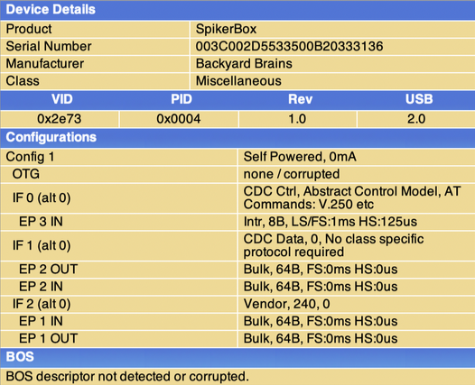
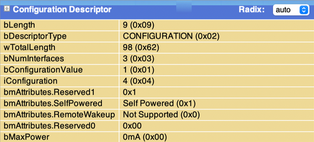
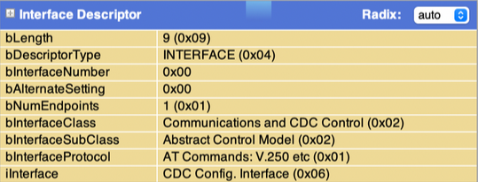
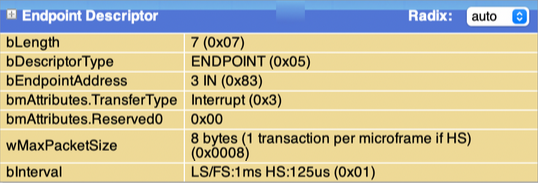
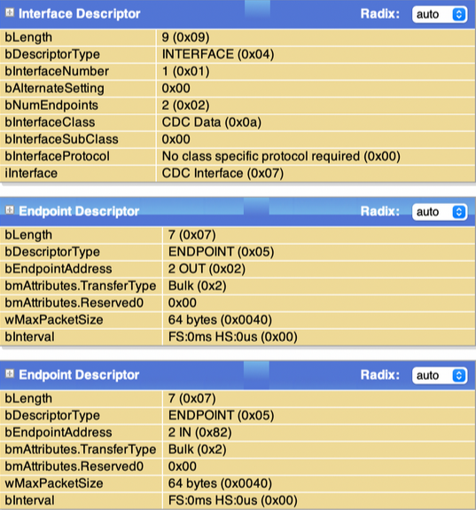
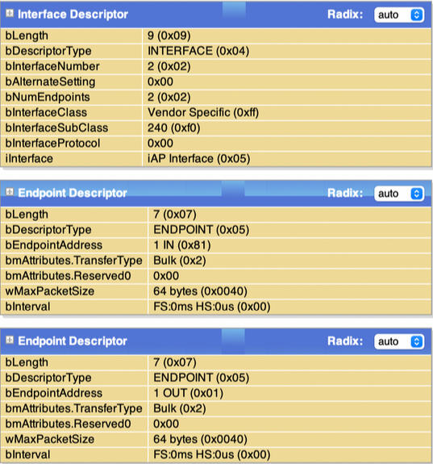

# Guide for USB Communication with SpikerBox

Version: R7 (05. April 2024)

Backyard Brains has numerous SpikerBox devices that can communicate via USB. Different SpikerBoxes implement different USB device classes:

### HID USB Device Class
- Muscle SpikerBox Pro (Pre 2023)
- Neuron SpikerBox Pro (Pre 2023)

### CDC (Serial) USB Device Class
- Plant SpikerBox
- Muscle SpikerShield (with genuine Arduino Uno)
- Muscle SpikerShield Pro (with genuine Arduino Uno)
- Muscle SpikerBox Pro
- Neuron SpikerBox Pro

### Vendor Specific Device Class
- Heart and Brain Spikerbox
- Human Human Interface (new)
- Neuron SpikerBox (single channel)
- Muscle SpikerBox (single channel)
- Muscle SpikerShield (with Chinese clone Arduino Uno)

### Composite Device (ACM CDC Interface + Vendor Specific Interface for iOS)
- Human SpikerBox
- Neuron SpikerBox
- Spike Station SpikerBox

SpikerBox will use HID, CDC (serial), or vendor specific interface to receive or send a stream of bytes to the host device (Win, macOS, Linux, Android, iOS). This stream of bytes will be formatted according to a custom protocol explained in this document. Each SpikerBox product will implement a subset of the custom protocol depending on the features it supports.

## Backyard Brains USB ID Table

| Date Valid          | MFG             | Product Description        | Vendor ID | ProductID | Interface Class |
| ------------------- | --------------- | -------------------------- | --------- | --------- | --------------- |
| 2017 (Old Muscle Pro) | BackyardBrains  | SpikeRecorder               | 0x2E73    | 0x0001    | 0x03            |
| 2017 (Old Neuron Pro) | BackyardBrains  | Neuron Pro                  | 0x2E73    | 0x0002    | 0x03            |
| 2022-Nov-01         | Backyard Brains | Human SpikerBox             | 0x2E73    | 0x0004    | 0x02 0x0a 0xFF  |
| 2022-Nov-01         | STMicroelectronics | STM32L4_Boot             | 0x2E73    | 0x0005    | 0x02            |
| 2022-Nov-01         | Backyard Brains | Muscle SpikerBox Pro        | 0x2E73    | 0x0006    | 0x02            |
| 2022-Nov-01         | Backyard Brains | Neuron SpikerBox Pro        | 0x2E73    | 0x0007    | 0x02            |
| 2022-Nov-01         | Backyard Brains | Plant SpikerBox             | 0x2341    | 0x8036    | 0x02            |
| 2022-Nov-01         | BYB             | Heart and Brain SpikerBox   | 0x0403    | 0x6015    | 0xFF            |
| 2023-4-20           | BYB             | Neuron SpikerBox Classic    | 0x0403    | 0x6015    | 0xFF            |
| 2022-Nov-01         | Backyard Brains | Muscle SpikerBox            | 0x0403    | 0x6015    | 0xFF            |
| 2022-Nov-01         | BYB             | Human Human Interface       | 0x0403    | 0x6015    | 0xFF            |
| 2023-Jan-01         | Backyard Brains | UniBox                      | 0x2E73    | 0x000D    | 0x02 0x0a 0xFF  |
| 2023-Jan-23         | BackyardBrains  | Neuron SpikerBox Pro        | 0x2E73    | 0x0009    | 0x02 0x0a 0xFF  |
| 2023-Oct-2023       | Backyard Brains | Neuron Bootloader           | 0x2E73    | 0x000A    | 0x02            |
| 2024-Mar-12         | BackyardBrains  | Spike Station Bootloader    | 0x2E73    | 0x000B    | 0x02            |

## SpikerBox Hardware Details

### Spike Station
- **USB Chip**: STM32L462RET6
- **USB VID**: 0x2E73 (Backyard Brains Inc)
- **USB PID**: 0x000D
- **Max Sampling Rate**: 42.6615kHz
- **Number of Channels**: 2 @ 42.6615kHz
- **Sample Resolution**: 14bit
- **USB Device Name**: SpikerBox
- **Serial Baud Rate**: Any
- **Expansion Port**: Reaction timer, Reflex hammer, Game controller events

### Muscle SpikerBox Pro (HID)
- **USB Chip**: MSP430F5522
- **USB VID**: 0x2E73 (Backyard Brains Inc.)
- **USB PID**: 0x001
- **Max Sampling Rate**: 10kHz
- **Number of Channels**: 
  - 2 @ 10kHz
  - 3 @ 5kHz
  - 4 @ 5kHz
- **Sample Resolution**: 10bit
- **USB Device Name**: SpikeRecorder
- **Max Useful Data Throughput**: 1000 packages/s with 62 Bytes (62kB)
- **Expansion Port**: Reaction timer, Reflex hammer, Game controller events

### Muscle SpikerBox Pro (Serial)
- **USB Chip**: MSP430F5522
- **USB VID**: 0x2E73 (Backyard Brains Inc.)
- **USB PID**: 0x006
- **Max Sampling Rate**: 10kHz
- **Number of Channels**: 
  - 2 @ 10kHz
  - 3 @ 5kHz
  - 4 @ 5kHz
- **Sample Resolution**: 10bit
- **USB Device Name**: Muscle SpikerBox Pro
- **Max Useful Data Throughput**: 1000 packages/s with 62 Bytes (62kB)
- **Expansion Port**: Reaction timer, Reflex hammer, Game controller events

### Neuron SpikerBox Pro (HID)
- **USB VID**: 0x2E73 (Backyard Brains Inc.)
- **USB PID**: 0x002
- **Max sampling rate**: 10kHz
- **Number of channels**:
  - **2 @ 10kHz**
  - **3 @ 5kHz**
  - **4 @ 5kHz**
- **Sample resolution**: 10bit
- **USB Device Name**: SpikeRecorder
- **Max useful data throughput**: 1000 packages/s with 62 Bytes (62kB)
  - **Expansion port (Reaction timer, Reflex hammer, Game controller,  events)**

### Neuron SpikerBox Pro (Serial)
- **USB VID**: 0x2E73 (Backyard Brains Inc.)
- **USB PID**: 0x007
- **Max sampling rate**: 10kHz
- **Number of channels**:
  - **2 @ 10kHz**
  - **3 @ 5kHz**
  - **4 @ 5kHz**
- **Sample resolution**: 10bit
- **USB Device Name**: Neuron SpikerBox Pro
- **Max useful data throughput**: 1000 packages/s with 62 Bytes (62kB)
  - **Expansion port (Reaction timer, Reflex hammer, Game controller,  events)**

### Neuron SpikerBox Pro (Serial + Mfi)
- **USB VID**: 0x2E73 (Backyard Brains Inc.)
- **USB PID**: 0x009
- **Max sampling rate**: 10kHz
- **Number of channels**:
  - **2 @ 10kHz**
  - **3 @ 10kHz**
- **Sample resolution**: 14bit
- **USB Device Name**: Neuron SpikerBox Pro
- **Serial baud rate**: 222222bps or 500000bps
  - **Expansion port (Reaction timer, Reflex hammer, Game controller,  events)**

### Heart & Brain SpikerBox
- **USB VID**: 0x0403 (FTDI)
- **USB PID**: 0x6015
- **Max sampling rate**: 10kHz
- **Number of channels**:
  - **1**
- **Sample resolution**: 10bit
- **Serial baud rate**: 222222bps
- **USB Device Name**: FT231X USB UART

### Plant SpikerBox
- **USB VID**: 0x2341 (Arduino SA)
- **USB PID**: 0x8036
- **Max sampling rate**: 10kHz
- **Number of channels**:
  - **1**
- **Sample resolution**: 10bit
- **Serial baud rate**: 222222bps (or 230400bps)
- **USB Device Name**: Arduino Leonardo

### (OBSOLETE) Human-Human-Interface
- **USB VID**: 0x2341 (Arduino SA)
- **USB PID**: 0x0043
- **Max sampling rate**: 10kHz
- **Number of channels**:
  - **1**
- **Sample resolution**: 10bit
- **Serial baud rate**: 222222bps (or 230400bps)
- **USB Device Name**: Arduino Uno

### Human-Human-Interface (second generation)
- **USB VID**: 0x0403 (FTDI)
- **USB PID**: 0x6015
- **Max sampling rate**: 10kHz
- **Number of channels**:
  - **1**
- **Sample resolution**: 10bit
- **Serial baud rate**: 500000 bps
- **USB Device Name**: HHI 1v1, Human Human Interface

### Muscle SpikerShield
- **USB VID**: 0x2341 (Arduino SA)
- **USB PID**: 0x0043
- **Max sampling rate**: 10kHz
- **Number of channels**:
  - **1 @ 10kHz**
  - **2 @ 5kHz**
  - **3 @ 3333Hz**
  - **4 @ 2500Hz**
  - **5 @ 2000Hz**
  - **6 @ 1666Hz**
- **Sample resolution**: 10bit
- **Serial baud rate**: 222222bps (or 230400bps)
- **USB Device Name**: Arduino Uno

### Muscle SpikerShield Pro
- **USB VID**: 0x2341 (Arduino SA)
- **USB PID**: 0x0043
- **Max sampling rate**: 10kHz
- **Number of channels**:
  - **1 @ 10kHz**
  - **2 @ 5kHz**
  - **3 @ 3333Hz**
  - **4 @ 2500Hz**
  - **5 @ 2000Hz**
  - **6 @ 1666Hz**
- **Sample resolution**: 10bit
- **Serial baud rate**: 222222bps (or 230400bps)
- **USB Device Name**: Arduino Uno

### Human SpikerBox
- **USB VID**: 0x2E73 (Backyard Brains Inc)
- **USB PID**: 0x0004
- **Max sampling rate**: 5kHz
- **Number of channels**:
  - **2 @ 5kHz**
  - **3 @ 5kHz**
  - **4 @ 5kHz**
- **Sample resolution**: 14bit
- **USB Device Name**: SpikerBox
- **Serial baud rate**: any
  - **Expansion port (Reaction timer, Reflex hammer, Game controller, events)**

### Human SpikerBox Bootloader
- **USB VID**: 0x2E73 (Backyard Brains Inc)
- **USB PID**: 0x0005
- **USB Device Name**: STM32L4_Boot

### Neuron SpikerBox Bootloader
- **USB VID**: 0x2E73 (Backyard Brains Inc)
- **USB PID**: 0x000A
- **USB Device Name**: Neuron SB Bootloader

### Spike Station Bootloader
- **USB VID**: 0x2E73 (Backyard Brains Inc)
- **USB PID**: 0x000B
- **USB Device Name**: Spike Station Bootloader

## SpikerBox Custom Protocol

Sample stream is a byte stream divided into frames. Each frame contains one sample for every recording channel. Depending on the SpikerBox type and mode of operation, the stream (and therefore the frame) can contain from one to six channels. The sample can be a 10 to 14 bit value, and two bytes represent each sample. For example, in the case of a two-channel SpikerBox, one frame will contain 4 bytes.

### Frame Structure

In order to mark the beginning of the frame, we reserve the most significant bit of every byte for the frame flag. If this bit is set to 1, the current byte represents the start of the frame. Ten bits of one data sample are divided into two bytes so that the first byte contains 3 most significant bits, and the second byte contains 7 least significant bits.



### Escape Sequences

Since the stream of samples from recording channels and custom messages share the same channel, all messages sent from SpikerBox are embedded in escape sequences. The same is not true for the messages sent from the Host software to the SpikerBox. The escape sequence that signals the beginning of the message block can appear on the communication channel at any time. So the Host software should be capable of detecting the escape sequence and extracting the message from the stream of data if SpikerBox is streaming recording data.

#### Start of Message Block
```hex
0xFF 0xFF 0x01 0x01 0x80 0xFF
```

#### End of Message Block
```hex
0xFF 0xFF 0x01 0x01 0x81 0xFF
```

### Custom Messages

Custom messages are currently used for a number of different purposes: 
- Start/stop of sampling stream
- Inform Host about firmware version, hardware version, and SpikerBox device type 
- Start firmware update procedure
- Inform Host about the type of device connected to the expansion port
- Exchange messages with the device connected to the expansion port

#### Message Syntax
Syntax of one message can be divided into five parts:
- Type of message 
- Colon separator 
- Value of message 
- Semicolon terminator
- In that same order.

Below are all messages supported:

#### Start Streaming Sample Data
**Message sent by the Host:**
```
start:;
```
**Supported by**: Muscle SpikerBox Pro, Neuron SpikerBox Pro

#### Stop Streaming Sample Data
**Message sent by the Host:**
```
h:;
```
**Supported by**: Muscle SpikerBox Pro, Neuron SpikerBox Pro


---

## Inquiry for Hardware Type

**Message sent by the Host:**

```
b:;
```

After receiving this message, SpikerBox will reply with messages that contain information about the hardware type:

```
HWT:[hardware type string];
```

**Example:**

```
HWT:PLANTSS;
```

### Current Hardware Types:

- **PLANTSS** (Plant SpikerBox, discontinued Plant SpikerShield)
- **MUSCLESS** (Muscle SpikerShield, Muscle SpikerShield Pro, Human-Human-Interface)
- **HEARTSS** (discontinued Heart and Brain SpikerShield)
- **HBLEOSB** (Heart and Brain SpikerBox)
- **HUMANSB** (Human SpikerBox)
- **MSBPCDC** (Muscle SpikerBox Pro (Serial))
- **NSBPCDC** (Neuron SpikerBox Pro (Serial))
- **NRNSBPRO** (Neuron SpikerBox Pro (Serial + Mfi))
- **HHIBOX** (Human Human Interface (new PCB))
- **UNIBOX** (Spike Station)

This message is supported only by:
- Plant SpikerBox
- Muscle SpikerShield
- Muscle SpikerShield Pro
- Human-Human-Interface
- Heart and Brain SpikerShield
- Heart and Brain SpikerBox
- Human SpikerBox
- Muscle SpikerBox Pro (Serial)
- Neuron SpikerBox Pro (Serial)

---

## Inquiry for Hardware Version, Firmware Version, and Hardware Type

**Message sent by the Host:**

```
?:;
```

After receiving this message, SpikerBox will reply with three messages that contain information about hardware version, firmware version, and hardware type:

```
FWV:[firmware version string];HWT:[hardware type string];HWV:[hardware version string];
```

**Example:**

```
FWV:0.01;HWT:NEURONSB;HWV:0.01;
```

### Current Hardware Types that Respond to this Message:

- **NEURONSB** (Neuron SpikerBox Pro)
- **MUSCLESB** (Muscle SpikerBox Pro)
- **HUMANSB** (Human SpikerBox)

This message is supported only by:
- Human SpikerBox
- Muscle SpikerBox Pro (HID and Serial)
- Neuron SpikerBox Pro (HID and Serial)

---

## Set Number of Channels

**Message sent by the Host:**

```
c:[number of channels];
```

After receiving this message, SpikerBox will change the number of channels it will send in the sample stream. This message does not have a response message.

**Example:**

```
c:3;
```

In the case of Muscle SpikerShield Pro, this message changes the number of channels the Muscle SpikerShield Pro will send to the host in the sample stream. It will also change the sample rate of the Muscle SpikerShield Pro to 10kHz/(number of channels).

This message is supported only by:
- Muscle SpikerShield
- Muscle SpikerShield Pro
- Heart and Brain SpikerShield

---

## Start Firmware Update Procedure

**Message sent by the Host:**

```
update:;
```

After receiving this message, the controller on the device will prepare for a firmware update. For Muscle SpikerBox Pro and Neuron SpikerBox Pro, we use controllers from the TI MSP430 family and the MSP430 USB Software Field Firmware Update Process, as explained in detail in the Texas Instruments manual “[USB Field Firmware Updates on MSP430™ MCUs](http://www.ti.com/lit/an/slaa452c/slaa452c.pdf).”

This message is supported only by:
- Muscle SpikerBox Pro
- Neuron SpikerBox Pro

---

## Event Message

**Message sent by the SpikerBox:**

```
EVNT:[event number];
```

**Example:**

```
EVNT:2;
```

This message is generated only by devices that support the expansion port:
- Muscle SpikerBox Pro (HID)
- Neuron SpikerBox Pro (HID)
- Human SpikerBox

---


## Type of Device Connected to Hardware I/O Interface

When a new device is connected or disconnected from the expansion I/O interface, the SpikerBox will send a custom message that contains information about the type of device connected to the SpikerBox:

```
BRD:[board type number];
```

### Example:

```
BRD:4;
```

The value of the message will be a number representing the type of the expansion board. Depending on the value received, the host should recognize the following expansion boards:

| Value | Expansion Board                                         |
|-------|---------------------------------------------------------|
| 0     | Five digital events (also the Reaction Timer works in this mode) |
| 1     | Board with two additional analog channels               |
| 4     | The Reflex Hammer                                       |
| 5     | The Game Controller                                     |

Details on decoding the type of the board and the description of the modes of operation of the device can be found in the document: **“SpikerBox Pro Hardware SDK”** on the BackyardBrains website.

This message is generated only by devices that support the expansion port: Muscle SpikerBox Pro, Neuron SpikerBox Pro, and Human SpikerBox.

---

## Ask for Type of Device Connected to Hardware I/O Interface

When a new device is connected to the expansion I/O interface of the SpikerBox before the SpikerBox is connected to the host computer, we can use the command:

```
board:;
```

To retrieve information about the connected device via the `BRD` response message.

This message is supported only by devices that support the expansion port: Muscle SpikerBox Pro, Neuron SpikerBox Pro, and Human SpikerBox.

---

## The Game Controller Button Press Command

When The Game Controller expansion board is connected to the expansion I/O interface, the SpikerBox will send information about any changes in button states on the Game Controller to the host.

```
JOY:[buttons state in binary form];
```

### Example:

```
JOY: 0b11110000 0b11110010;
```

Since The Game Controller has 8 buttons, we can use 8 bits to represent the state of all buttons that have two states: pressed/released. If the corresponding bit has a value of 1, the button is pressed; if the corresponding bit has a value of 0, the button is not pressed (released).

This binary representation of the state of 8 buttons can theoretically be represented as one byte with 8 bits. However, because this byte will be sent embedded in the command string, we divided the binary information into two bytes to avoid sending a null string termination character when none of the buttons are pressed.

Each of the two bytes sent will have the following binary format:

```
0b1111xxxx
```

Where the 4 most significant bits will always have a fixed value of 1, and the 4 least significant bits will encode the state of 4 buttons. In the example above, only the second button is pressed, and all other buttons are not pressed.

This message is generated only by devices that support the expansion port: Muscle SpikerBox Pro, Neuron SpikerBox Pro, and Human SpikerBox.

---

## Turn ON Button Backlight on The Game Controller

When The Game Controller expansion board is connected to the expansion I/O interface, the software on the host can send commands to turn ON the light behind each button on the Game Controller:

```
ledon:[button number];
```

### Example:

```
ledon:4;
```

The value of the message represents the index of the button for which we want to turn the backlight ON.

This message can be received only by devices that support the expansion port: Muscle SpikerBox Pro, Neuron SpikerBox Pro, and Human SpikerBox.

---

## Turn OFF Button Backlight on The Game Controller

When The Game Controller expansion board is connected to the expansion I/O interface, the software on the host can send commands to turn OFF the light behind each button on the Game Controller:

```
ledoff:[button number];
```

### Example:

```
ledoff:4;
```

The value of the message represents the index of the button for which we want to turn the backlight OFF.

This message can be received only by devices that support the expansion port: Muscle SpikerBox Pro, Neuron SpikerBox Pro, and Human SpikerBox.

---


## Turn ON High Gain Setting on Human SpikerBox Input Channel

Human SpikerBox has two different gain settings (low and high gain) that can be controlled on each input channel separately. The host can send a message to turn ON the high gain setting using the command:

```
gainon:[channel number];
```

**Example:**

```
gainon:1;
```

The value of the message represents the index of the channel. Valid values are: `1` and `2`.

This message can be received only by the Human SpikerBox device.

---

## Turn OFF High Gain Setting on Human SpikerBox Input Channel

Human SpikerBox has two different gain settings (low and high gain) that can be controlled on each input channel separately. The host can send a message to turn OFF the high gain setting using the command:

```
gainoff:[channel number];
```

**Example:**

```
gainoff:2;
```

The value of the message represents the index of the channel. Valid values are: `1` and `2`.

This message can be received only by the Human SpikerBox device.

---

## Change Cut-off Frequency of High Pass Filter on Human SpikerBox Input Channel (High Value)

Human SpikerBox can switch between two different values for cut-off frequency on the hardware HPF. This setting can be controlled on each input channel separately. The host can set a greater value of HPF cut-off frequency by sending the command:

```
hpfon:[channel number];
```

**Example:**

```
hpfon:1;
```

The value of the message represents the index of the channel. Valid values are: `1` and `2`.

This message can be received only by the Human SpikerBox device.

---

## Change Cut-off Frequency of High Pass Filter on Human SpikerBox Input Channel (Low Value)

Human SpikerBox can switch between two different values for cut-off frequency on the hardware HPF. This setting can be controlled on each input channel separately. The host can set a lower value of HPF cut-off frequency by sending the command:

```
hpfoff:[channel number];
```

**Example:**

```
hpfoff:2;
```

The value of the message represents the index of the channel. Valid values are: `1` and `2`.

This message can be received only by the Human SpikerBox device.

---

## Turn ON P300 Experiment Stimulation

When the host wants to start P300 stimulation on the device, the host can send the command:

```
stimon:;
```

This command does not have any value.

This message can be received only by the Human SpikerBox device.

---

## Turn OFF P300 Experiment Stimulation

When the host wants to stop P300 stimulation on the device, the host can send the command:

```
stimoff:;
```

This command does not have any value.

This message can be received only by the Human SpikerBox device.

---

## Ask Device if P300 Stimulation is Active

When the host wants to determine if P300 stimulation is currently active and running on the SpikerBox device, the host can send the command:

```
p300?:;
```

This command does not have any value.

This message can be received only by the Human SpikerBox device.

After receiving the message, the SpikerBox will respond with the message:

```
p300:[state of stimulation];
```

**Example:**

```
p300:1;
```

The value of the message represents the state of the P300 stimulation process. Valid values are `0` and `1`. Value `0` is sent when P300 stimulation is not active, and value `1` is sent when P300 stimulation is active.

---

## Turn ON P300 Audio Stimulation

When the host wants to switch from P300 visual stimulation to audio stimulation on the SpikerBox, the host can send the command:

```
sounon:;
```

This command does not have any value.

This message can be received only by the Human SpikerBox device.

---

## Turn OFF P300 Audio Stimulation

When the host wants to stop P300 audio stimulation on the device, the host can send the command:

```
sounoff:;
```

This command does not have any value.

This message can be received only by the Human SpikerBox device.

---

## Ask Device if P300 Audio Stimulation is Active

When the host wants to determine if P300 audio stimulation is currently active on the SpikerBox device, the host can send the command:

```
sound?:;
```

This command does not have any value.

This message can be received only by the Human SpikerBox device.

After receiving the message, the SpikerBox will respond with the message:

```
sound:[state of audio stimulation];
```

**Example:**

```
sound:1;
```

The value of the message represents the state of the P300 audio stimulation. Valid values are `0` and `1`. Value `0` is sent when P300 audio stimulation is not set, and value `1` is sent when P300 audio stimulation is set. Please note that `sound:1;` only means that audio stimulation is set, but it does not necessarily mean that P300 stimulation is active and running. To get the complete information, one must always ask if P300 is running using the `p300?:;` message.
```

## Ask for Preset Filter Configuration

When the host wants to determine the current filter and gain preset configuration (EEG, ECG, EMG, Plant, Intracellular Neuron, Extracellular Neuron), the host can send the following command:

```
preset?:[channel];
```

### The `channel` Parameter
- **Zero:** In this case, SpikerBox should return info for all channels.
  
  **Example:**
  ```
  preset?:0;
  ```
- **Number of the channel:** For the specific channel whose filter configuration you want to get. The index of the channel starts from 1.
  
  **Example:**
  ```
  preset?:1;
  ```

After receiving the message, the SpikerBox will respond with messages containing the name of the preset currently in use.

**This message is supported only by the Spike Station Board product.**

### Preset Configuration Message

```
preset:[channel_name of preset];
```

This message has a composite value divided by an underscore character. 

- **First part:** Represents the channel for which the SpikerBox is sending its configuration. The index starts from 1.
- **Second part:** Represents the preset name. This can be one of the following:
  - EEG
  - EMG
  - ECG
  - INTNEUR (Intracellular Neuron)
  - EXTNEUR (Extracellular Neuron)
  - CUSTOM

**Examples:**
```
preset:1_EEG;
```

---

## Ask Device for Current Filter Configuration

When the host wants to determine the current filter configuration (high pass cutoff, low pass cutoff, notch state), the host can send the following command:

```
filter?:[channel];
```

### The `channel` Parameter
- **Zero:** In this case, SpikerBox should return info for all channels.
  
  **Example:**
  ```
  filter?:0;
  ```
- **Number of the channel:** For the specific channel whose filter configuration you want to get. The index of the channel starts from 1.
  
  **Example:**
  ```
  filter?:1;
  ```

After receiving the message, the SpikerBox will respond with messages for high pass filter, low pass filter, and notch filter configurations.

**This message is supported only by the Spike Station Board product.**

---

### High Pass Filter Configuration Message (SpikerBox sends to Host)

```
hpfilter:[channel_cut-off frequency];
```

This message has a composite value divided by an underscore character. 

- **First part:** Represents the channel for which the SpikerBox is sending its configuration. The index starts from 1.
- **Second part:** Represents the cutoff frequency value. This value can be a float or integer and can range from 0 to half of the sample rate of the SpikerBox device. If the second part (frequency) is a negative number, it means the filter is turned OFF or not present on the hardware.

**Examples:**
```
hpfilter:1_0.1;
```
- The cutoff frequency of the hardware high pass filter for the first channel is set to 0.1Hz.

```
hpfilter:2_-1;
```
- The hardware high pass filter for the second channel is turned OFF or not present on the board.

```
hpfilter:2_200;
```
- The cutoff frequency of the hardware high pass filter for the second channel is set to 200Hz.

**This message is supported only by the Spike Station Board product.**

---

### Low Pass Filter Configuration Message (SpikerBox sends to Host)

```
lpfilter:[channel_cut-off frequency];
```

This message has a composite value divided by an underscore character. 

- **First part:** Represents the channel for which the SpikerBox is sending its configuration. The index starts from 1.
- **Second part:** Represents the cutoff frequency value. This value can be a float or integer and can range from 0 to half of the sample rate of the SpikerBox device. If the second part (frequency) is a negative number, it means the filter is turned OFF or not present on the hardware.

**Examples:**
```
lpfilter:1_2000.3;
```
- The cutoff frequency of the hardware low pass filter for the first channel is set to 2000.3Hz.

```
lpfilter:1_-1;
```
- The hardware low pass filter for the second channel is turned OFF or not present on the board.

```
lpfilter:3_50;
```
- The cutoff frequency of the hardware low pass filter for the third channel is set to 50Hz.

**This message is supported only by the Spike Station Board product.**

---

### Notch Filter Configuration Message (SpikerBox sends to Host)

```
notch:[channel_notch frequency];
```

This message has a composite value divided by an underscore character. 

- **First part:** Represents the channel for which the SpikerBox is sending its configuration. The index starts from 1.
- **Second part:** Represents the notch frequency value. This value can be 50 or 60. If the second part (frequency) is a negative number, it means the filter is turned OFF or not present on the hardware.

**Examples:**
```
notch:1_50;
```
- The notch frequency of the hardware notch filter for the first channel is set to 50Hz.

```
notch:2_-1;
```
- The hardware notch filter for the second channel is turned OFF or not present on the board.

```
notch:1_60;
```
- The notch frequency of the hardware notch filter for the first channel is set to 60Hz.

**This message is supported only by the Spike Station Board product.**

---

## Set Hardware Filter Configuration on SpikerBox

When host software wants to set filter settings on SpikerBox, it can use one of the following commands:

### Set High Pass Filter Cut-Off Frequency (Host sends to SpikerBox)

```
sethpf:[channel_cut-off frequency];
```

This message has a composite value divided by an underscore character. 

- **First part:** Represents the channel for which the SpikerBox is sending its configuration. The index starts from 1.
- **Second part:** Represents the cutoff frequency value. This value can be a float or integer and can range from 0 to half of the sample rate of the SpikerBox device. If the second part (frequency) is a negative number, it means the filter should be turned OFF.

**Examples:**
```
sethpf:1_0.1;
```
- Set high pass filter cutoff frequency on the first channel to 0.1Hz.

```
sethpf:2_70;
```
- Set high pass filter cutoff frequency on the second channel to 70Hz.

```
sethpf:2_-1;
```
- Turn OFF the high pass filter on the second channel.

**This message is supported only by: no products**

---

### Set Low Pass Filter Cut-Off Frequency (Host sends to SpikerBox)

```
setlpf:[channel_cut-off frequency];
```

This message has a composite value divided by an underscore character. 

- **First part:** Represents the channel for which the SpikerBox is sending its configuration. The index starts from 1.
- **Second part:** Represents the cutoff frequency value. This value can be a float or integer and can range from 0 to half of the sample rate of the SpikerBox device. If the second part (frequency) is a negative number, it means the filter should be turned OFF.

**Examples:**
```
setlpf:1_1500;
```
- Set low pass filter cutoff frequency on the first channel to 1500Hz.

```
setlpf:2_50.5;
```
- Set low pass filter cutoff frequency on the second channel to 50.5Hz.

```
setlpf:3_-1;
```
- Turn OFF the low pass filter on the third channel.

**This message is supported only by: no products**

---

### Set Notch Filter Frequency (Host sends to SpikerBox)

```
setnotch:[channel_notch frequency];
```

This message has a composite value divided by an underscore character. 

- **First part:** Represents the channel for which the SpikerBox is sending its configuration. The index starts from 1.
- **Second part:** Represents the notch frequency value. This value can be 50 or 60. If the second part (frequency) is a negative number, it means the filter should be turned OFF.

**Examples:**
```
setnotch:1_50;
```
- Set notch frequency for the filter on the first channel to 50Hz.

```
setnotch:2_60;
```
- Set notch frequency for the filter on the second channel to 60Hz.

```
setnotch:1_-1;
```
- Turn OFF the notch filter on the first channel.

**This message is supported only by: no products**
```
## HID USB devices 

The Muscle SpikerBox Pro and Neuron SpikerBox Pro devices are USB HID device class devices. The HID datapipe interface is based on USB’s interrupt transfer type. Every 1ms one USB frame is transferred from SpikerBox to Host software. Each frame received by the Host software side will have 64 bytes. First byte represents the type of the frame (it will be constant) and can be ignored. Second byte represents length of data (in bytes) in payload and it should be used when extracting data from payload block. And rest 62 bytes represent actual data formatted according to the SpikerBox custom protocol.

When sending HID package from Host software to SpikerBox we will need to format data frame/package according to the following rule. First byte in the package defines type of HID data frame and should always be set to 0x3F value. Second byte represents length of payload data and should be always be set to 0x3E value which equals to 62 in decimal representation. Buffer should be always 64 bytes long even if the data content (custom message) is shorter than 64 bytes. The rest of the bytes can contain messages according to the SpikerBox custom protocol.


## Human SpikerBox Descriptor

Human SpikerBox is a device that must support connection to iOS devices via iAP2 protocol and Windows, macOS and Android devices via CDC USB interface device class. Therefore Human SpikerBox has a composite device descriptor. Details are displayed below:














# Human SB, Neuron SB, and Spike Station Firmware Update

## Host and SpikerBox Communication

| Host        | SpikerBox   | Comment                                                |
|-------------|-------------|--------------------------------------------------------|
| `">BL<"` -> |             | Host sends `">HB<"` command to SB                      |
|             | Writes flag | SpikerBox writes special flag to the last address of the flash. Flag is `0x0123456789ABCDEF`. |
|             | Resets      |                                                        |

## Bootloader Firmware

| Host        | SpikerBox   | Comment                                                |
|-------------|-------------|--------------------------------------------------------|
|             | Checks flag | Check if special flag is in the last address of the flash |
|             | Clears flag | Clears flag so that it does not enter the bootloader again |
| `<- 'g'`    |             | Send periodically 'g' and reads CDC data               |
| `'n' ->`    |             | Host initializes by sending 'n'                        |
| `<- 'n'`    |             | SpikerBox responds with 'n'                            |
| `4 bytes ->`|             | Host responds with length of firmware in 4 bytes       |
| `<- 'x'`    |             | SpikerBox asks for first 8 bytes of firmware by sending 'x' |
| `8 bytes ->`|             | Host sends 8 bytes of firmware                         |
| `<- 'x'`    |             | SpikerBox asks for next 8 bytes by sending 'x'         |
| `8 bytes ->`|             | Host sends 8 bytes of firmware                         |
| `<- 'x'`    |             | SpikerBox asks for next 8 bytes by sending 'x'         |
| `8 bytes ->`|             | Host sends 8 bytes of firmware                         |
| ...         |             |                                                        |
| `<- 'x'`    |             | SpikerBox asks for next 8 bytes by sending 'x'         |
| `8 bytes ->`|             | Host sends 8 bytes of firmware                         |
| `<- 'e'`    |             | SpikerBox sends 'e' to notify that it will end firmware update and jump to main firmware |
